<div align="center">
    <h1 style="display: inline-flex; align-items: center;">
        
        The Latent Space: Foundation, Evolution, Mechanism, Ability, and Outlook
    </h1>
</div>

<!-- <p align="center">
    <a href="https://github.com/sindresorhus/awesome"></a>
    <a href="https://github.com/YU-deep/Awesome-Latent-Space/stargazers"></a>
    <a href="LICENSE"></a>
    <a href="https://arxiv.org/abs/2604.02029"></a>
    <a href="https://huggingface.co/papers/2604.02029"></a>
    <a href="CONTRIBUTING.md"></a>
    <a href="img/static/wechat_group.jpg"></a>
    <a href="https://www.semanticscholar.org/paper/The-Latent-Space%3A-Foundation%2C-Evolution%2C-Mechanism-Yu-Chen/47e1ecd29e617de26cc03f9615e303b19f52cfe1"></a>
</p> -->

This repository manually collects works in **Progress Models**, which will be continuously updated.


## 📖 News
**[2026/05/04]** We release our survey: [The Latent Space: Foundation, Evolution, Mechanism, Ability, and Outlook](https://arxiv.org/pdf/2604.02029)!

[](https://star-history.com/#YU-deep/Awesome-Latent-Space&Date)

## 🌟 Overview
- [📖 News](#-news)
- [🌟 Overview](#-overview)
- [📄 Citation](#-citation)
- [🤝 Contributing](#-contributing)
- [🔥 Methods](#-methods)


## 📄 Citation
If you find this survey helpful, a citation to our paper would be greatly appreciated:
```bibtex
TBD
```


## 🤝 Contributing
We warmly welcome contributions of excellent resources you find via **pull request**. Please follow the instruction in **CONTRIBUTING.md** if you want to make one.
Additionally, if you want to have any other issue, please add our wechat group.


## 🔥 Methods
| Date | Paper Title | Introduction | Code | Citation |
|------|-------------|--------------|------|----------|
| 2026/04 | [ARM: Advantage Reward Modeling for Long-Horizon Manipulation](https://arxiv.org/abs/2604.03037) | 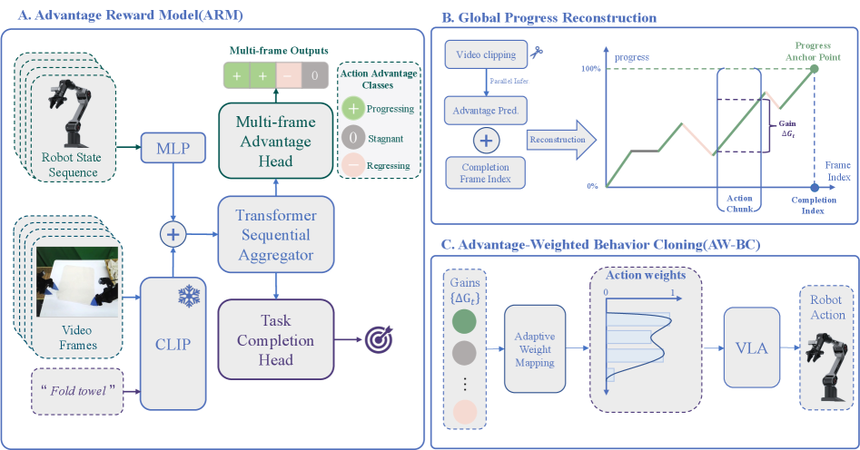 | - | <details><summary>bib.tex</summary><pre><code class="language-bibtex">@misc{mao2026armadvantagerewardmodeling,<br>  title={ARM: Advantage Reward Modeling for Long-Horizon Manipulation},<br>  author={Yiming Mao and Zixi Yu and Weixin Mao and Yinhao Li and Qirui Hu and Zihan Lan and Minzhao Zhu and Hua Chen},<br>  year={2026},<br>  eprint={2604.03037},<br>  archivePrefix={arXiv},<br>  primaryClass={cs.RO},<br>  url={https://arxiv.org/abs/2604.03037},<br>}</code></pre></details> |
| 2026/04 | [Generalizable Dense Reward for Long-Horizon Robotic Tasks](https://arxiv.org/abs/2604.00055) | 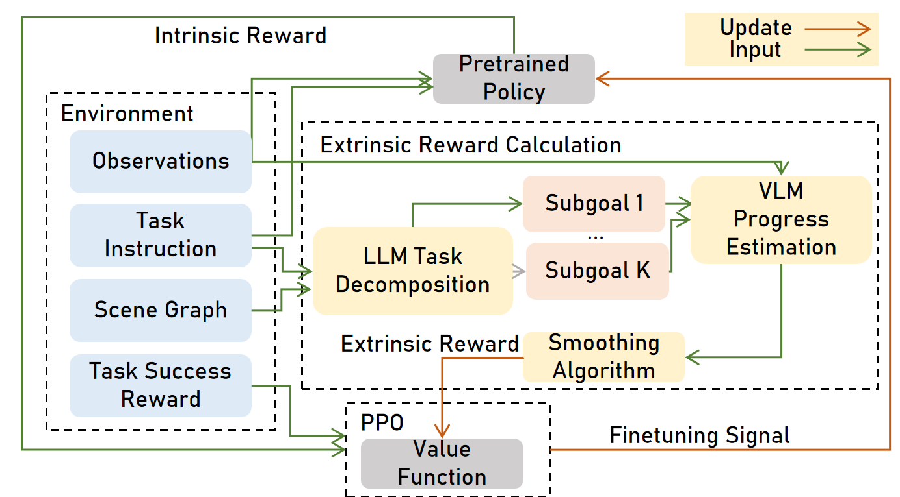 | - | <details><summary>bib.tex</summary><pre><code class="language-bibtex">@misc{yong2026generalizabledenserewardlonghorizon,<br>  title={Generalizable Dense Reward for Long-Horizon Robotic Tasks},<br>  author={Silong Yong and Stephen Sheng and Carl Qi and Xiaojie Wang and Evan Sheehan and Anurag Shivaprasad and Yaqi Xie and Katia Sycara and Yesh Dattatreya},<br>  year={2026},<br>  eprint={2604.00055},<br>  archivePrefix={arXiv},<br>  primaryClass={cs.RO},<br>  url={https://arxiv.org/abs/2604.00055},<br>}</code></pre></details> |
| 2026/03 | [Robometer: Scaling General-Purpose Robotic Reward Models via Trajectory Comparisons](https://arxiv.org/abs/2603.02115) | 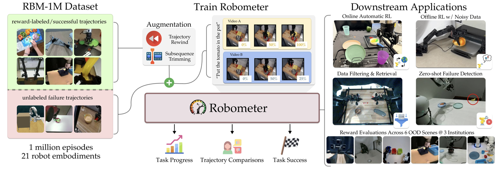 | [GitHub](https://github.com/robometer/robometer) | <details><summary>bib.tex</summary><pre><code class="language-bibtex">@misc{liang2026robometerscalinggeneralpurposerobotic,<br>  title={Robometer: Scaling General-Purpose Robotic Reward Models via Trajectory Comparisons},<br>  author={Anthony Liang and Yigit Korkmaz and Jiahui Zhang and Minyoung Hwang and Abrar Anwar and Sidhant Kaushik and Aditya Shah and Alex S. Huang and Luke Zettlemoyer and Dieter Fox and Yu Xiang and Anqi Li and Andreea Bobu and Abhishek Gupta and Stephen Tu and Erdem Biyik and Jesse Zhang},<br>  year={2026},<br>  eprint={2603.02115},<br>  archivePrefix={arXiv},<br>  primaryClass={cs.RO},<br>  url={https://arxiv.org/abs/2603.02115},<br>}</code></pre></details> |
| 2026/02 | [TOPReward: Token Probabilities as Hidden Zero-Shot Rewards for Robotics](https://arxiv.org/abs/2602.19313) | 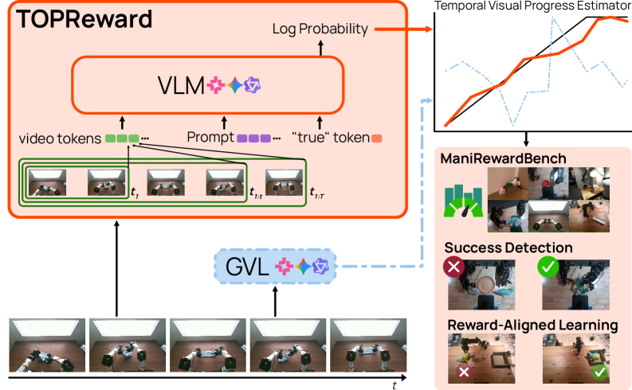 | [GitHub](https://github.com/TOPReward/TOPReward) | <details><summary>bib.tex</summary><pre><code class="language-bibtex">@misc{chen2026toprewardtokenprobabilitieshidden,<br>  title={TOPReward: Token Probabilities as Hidden Zero-Shot Rewards for Robotics},<br>  author={Shirui Chen and Cole Harrison and Ying-Chun Lee and Angela Jin Yang and Zhongzheng Ren and Lillian J. Ratliff and Jiafei Duan and Dieter Fox and Ranjay Krishna},<br>  year={2026},<br>  eprint={2602.19313},<br>  archivePrefix={arXiv},<br>  primaryClass={cs.RO},<br>  url={https://arxiv.org/abs/2602.19313},<br>}</code></pre></details> |
| 2026/01 | [PROGRESSLM: Towards Progress Reasoning in Vision-Language Models](https://arxiv.org/abs/2601.15224) | 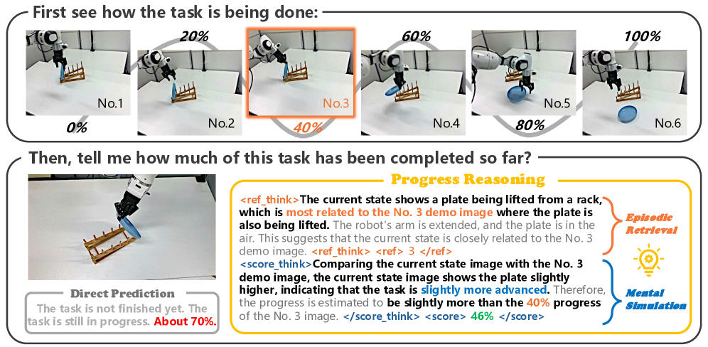 | [GitHub](https://github.com/ProgressLM/ProgressLM) | <details><summary>bib.tex</summary><pre><code class="language-bibtex">@misc{zhang2026progresslmprogressreasoningvisionlanguage,<br>  title={PROGRESSLM: Towards Progress Reasoning in Vision-Language Models},<br>  author={Jianshu Zhang and Chengxuan Qian and Haosen Sun and Haoran Lu and Dingcheng Wang and Letian Xue and Han Liu},<br>  year={2026},<br>  eprint={2601.15224},<br>  archivePrefix={arXiv},<br>  primaryClass={cs.CV},<br>  url={https://arxiv.org/abs/2601.15224},<br>}</code></pre></details> |
| 2025/12  |  <br/> [Robo-Dopamine: General Process Reward Modeling for High-Precision Robotic Manipulation](https://arxiv.org/abs/2512.23703) | 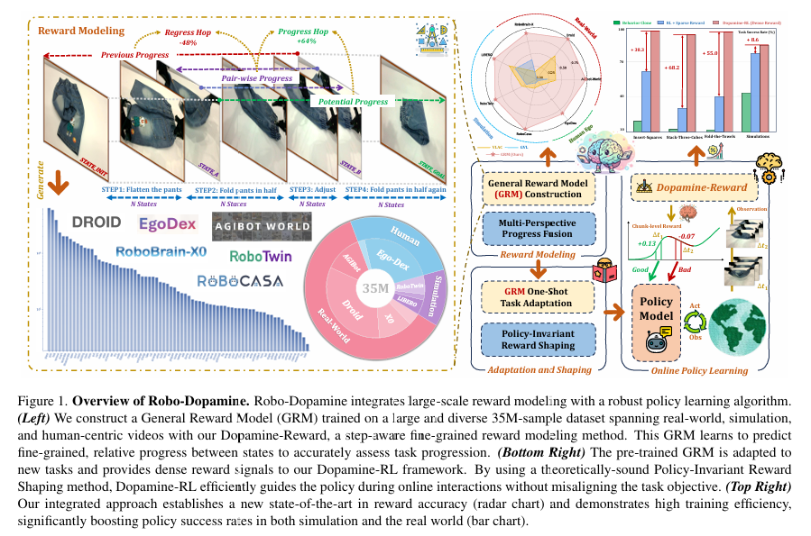 | [Github](https://github.com/FlagOpen/Robo-Dopamine) | <details><summary>bib.tex</summary><pre><code class="language-bibtex">@article{tan2025robo,<br>  title={Robo-Dopamine: General Process Reward Modeling for High-Precision Robotic Manipulation},<br>  author={Tan, Huajie and Chen, Sixiang and Xu, Yijie and Wang, Zixiao and Ji, Yuheng and Chi, Cheng and Lyu, Yaoxu and Zhao, Zhongxia and Chen, Xiansheng and Co, Peterson and Xie, Shaoxuan and Yao, Guocai and Wang, Pengwei and Wang, Zhongyuan and Zhang, Shanghang},<br>  journal={arXiv preprint arXiv:2512.23703},<br>  year={2025}<br>}</code></pre></details> |
| 2025/09 | [SARM: Stage-Aware Reward Modeling for Long Horizon Robot Manipulation](https://arxiv.org/abs/2509.25358) | 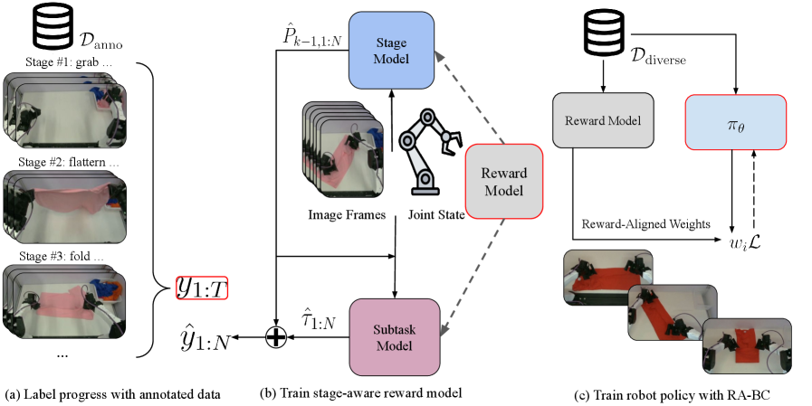 | [GitHub](https://github.com/xdofai/opensarm) | <details><summary>bib.tex</summary><pre><code class="language-bibtex">@misc{chen2025sarmstageawarerewardmodeling,<br>  title={SARM: Stage-Aware Reward Modeling for Long Horizon Robot Manipulation},<br>  author={Qianzhong Chen and Justin Yu and Mac Schwager and Pieter Abbeel and Yide Shentu and Philipp Wu},<br>  year={2025},<br>  eprint={2509.25358},<br>  archivePrefix={arXiv},<br>  primaryClass={cs.RO},<br>  url={https://arxiv.org/abs/2509.25358},<br>}</code></pre></details> |
| 2025/09  |  <br/> [OpenGVL -- Benchmarking Visual Temporal Progress for Data Curation](https://arxiv.org/abs/2509.17321) | 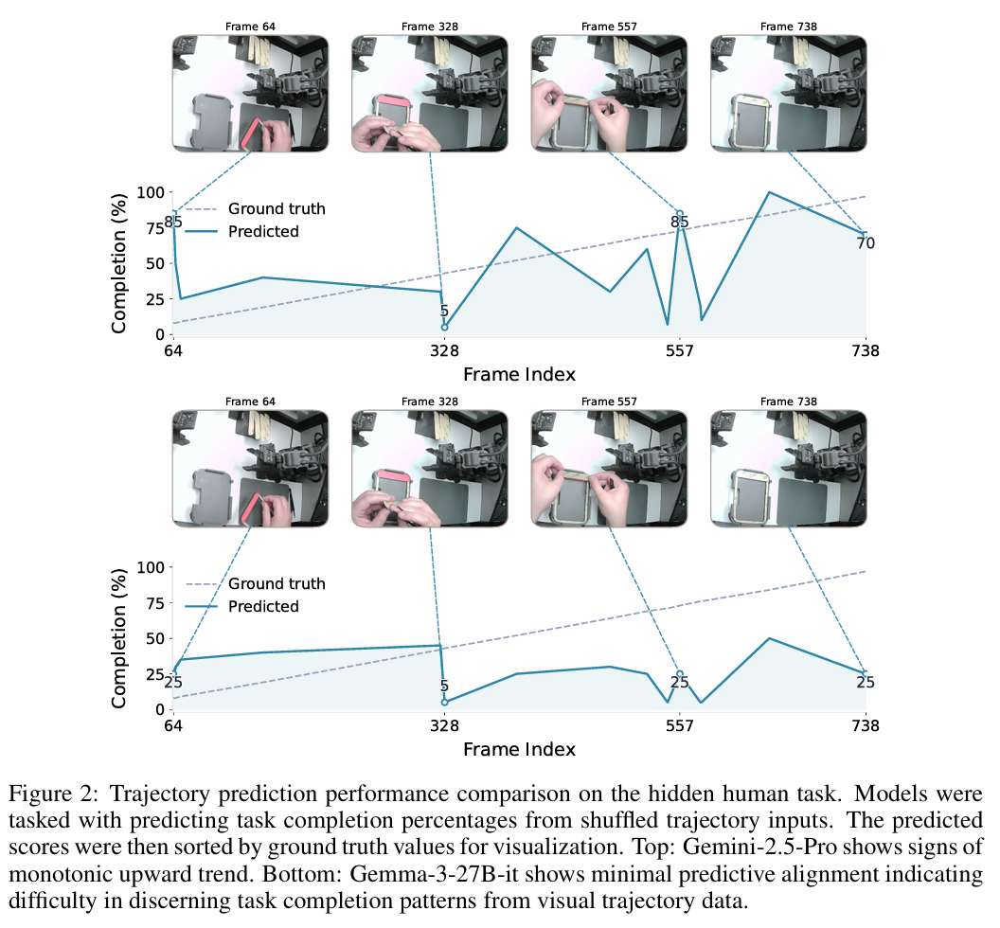 | [Github](https://github.com/budzianowski/opengvl) | <details><summary>bib.tex</summary><pre><code class="language-bibtex">@article{budzianowski2025opengvl,<br>  title={OpenGVL -- Benchmarking Visual Temporal Progress for Data Curation},<br>  author={Budzianowski, Pawe{\l} and Wi{\'s}nios, Emilia and Tyrolski, Micha{\l} and G{\'o}ral, Gracjan and Kulakov, Igor and Petrenko, Viktor and Walas, Krzysztof},<br>  journal={arXiv preprint arXiv:2509.17321},<br>  year={2025}<br>}</code></pre></details> |
| 2025/09  |  <br/> [A Vision-Language-Action-Critic Model for Robotic Real-World Reinforcement Learning (VLAC)](https://arxiv.org/abs/2509.15937) | 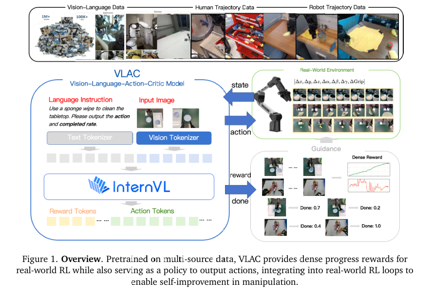 | [Github](https://github.com/InternRobotics/VLAC) | <details><summary>bib.tex</summary><pre><code class="language-bibtex">@article{zhai2025vision,<br>  title={A Vision-Language-Action-Critic Model for Robotic Real-World Reinforcement Learning},<br>  author={Zhai, Shaopeng and Zhang, Qi and Zhang, Tianyi and Huang, Fuxian and Zhang, Haoran and Zhou, Ming and Zhang, Shengzhe and Liu, Litao and Lin, Sixu and Pang, Jiangmiao},<br>  journal={arXiv preprint arXiv:2509.15937},<br>  year={2025}<br>}</code></pre></details> |
| 2025/05 | [ReWiND: Language-Guided Rewards Teach Robot Policies without New Demonstrations](https://arxiv.org/abs/2505.10911) | 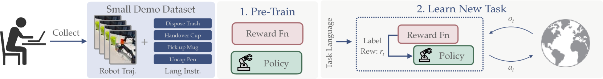 | [GitHub](https://github.com/rewind-reward/ReWiND) | <details><summary>bib.tex</summary><pre><code class="language-bibtex">@misc{zhang2025rewindlanguageguidedrewardsteach,<br>  title={ReWiND: Language-Guided Rewards Teach Robot Policies without New Demonstrations},<br>  author={Jiahui Zhang and Yusen Luo and Abrar Anwar and Sumedh Anand Sontakke and Joseph J Lim and Jesse Thomason and Erdem Biyik and Jesse Zhang},<br>  year={2025},<br>  eprint={2505.10911},<br>  archivePrefix={arXiv},<br>  primaryClass={cs.RO},<br>  url={https://arxiv.org/abs/2505.10911},<br>}</code></pre></details> |
| 2024/11  |  <br/> [Vision Language Models are In-Context Value Learners](https://arxiv.org/abs/2411.04549) | 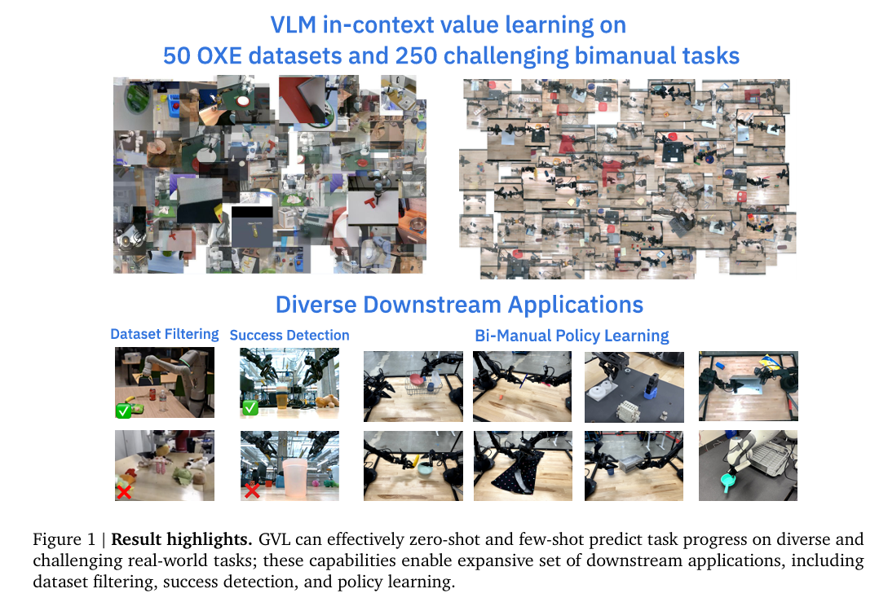 | - | <details><summary>bib.tex</summary><pre><code class="language-bibtex">@inproceedings{ma2025vision,<br>  title={Vision Language Models are In-Context Value Learners},<br>  author={Ma, Yecheng Jason and Hejna, Joey and Wahid, Ayzaan and Fu, Chuyuan and Shah, Dhruv and Liang, Jacky and Xu, Zhuo and Kirmani, Sean and Xu, Peng and Driess, Danny and Tompson, Jonathan and Bastani, Osbert and Jayaraman, Dinesh and Yu, Wenhao and Zhang, Tingnan and Sadigh, Dorsa and Xia, Fei},<br>  booktitle={The Thirteenth International Conference on Learning Representations},<br>  year={2025},<br>  url={https://openreview.net/forum?id=friHAl5ofG}<br>}</code></pre></details> |
| 2024/10 | [On-Robot Reinforcement Learning with Goal-Contrastive Rewards](https://arxiv.org/abs/2410.19989) | 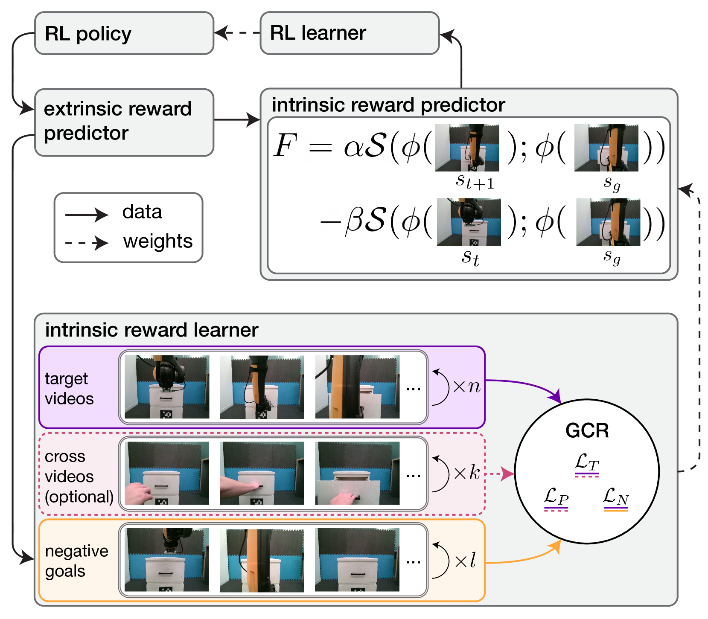 | - | <details><summary>bib.tex</summary><pre><code class="language-bibtex">@misc{biza2025onrobotreinforcementlearninggoalcontrastive,<br>  title={On-Robot Reinforcement Learning with Goal-Contrastive Rewards},<br>  author={Ondrej Biza and Thomas Weng and Lingfeng Sun and Karl Schmeckpeper and Tarik Kelestemur and Yecheng Jason Ma and Robert Platt and Jan-Willem van de Meent and Lawson L. S. Wong},<br>  year={2025},<br>  eprint={2410.19989},<br>  archivePrefix={arXiv},<br>  primaryClass={cs.RO},<br>  url={https://arxiv.org/abs/2410.19989},<br>}</code></pre></details> |
| 2024/05 | [Video-Language Critic: Transferable Reward Functions for Language-Conditioned Robotics](https://arxiv.org/abs/2405.19988) | 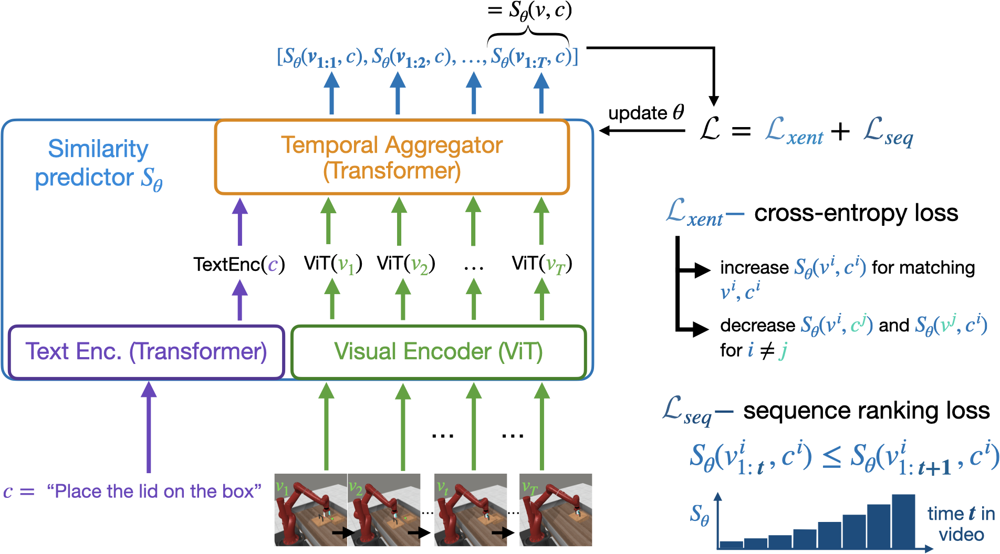 | [GitHub](https://github.com/minttusofia/video_language_critic) | <details><summary>bib.tex</summary><pre><code class="language-bibtex">@misc{alakuijala2025videolanguagecritictransferablereward,<br>  title={Video-Language Critic: Transferable Reward Functions for Language-Conditioned Robotics},<br>  author={Minttu Alakuijala and Reginald McLean and Isaac Woungang and Nariman Farsad and Samuel Kaski and Pekka Marttinen and Kai Yuan},<br>  year={2025},<br>  eprint={2405.19988},<br>  archivePrefix={arXiv},<br>  primaryClass={cs.RO},<br>  url={https://arxiv.org/abs/2405.19988},<br>}</code></pre></details> |
| 2024/04 | [Rank2Reward: Learning Shaped Reward Functions from Passive Video](https://arxiv.org/abs/2404.14735) |  | [GitHub](https://github.com/dxyang/rank2reward) | <details><summary>bib.tex</summary><pre><code class="language-bibtex">@misc{yang2024rank2rewardlearningshapedreward,<br>  title={Rank2Reward: Learning Shaped Reward Functions from Passive Video},<br>  author={Daniel Yang and Davin Tjia and Jacob Berg and Dima Damen and Pulkit Agrawal and Abhishek Gupta},<br>  year={2024},<br>  eprint={2404.14735},<br>  archivePrefix={arXiv},<br>  primaryClass={cs.RO},<br>  url={https://arxiv.org/abs/2404.14735},<br>}</code></pre></details> |
| 2024/02  |  <br/> [RL-VLM-F: Reinforcement Learning from Vision Language Foundation Model Feedback](https://arxiv.org/abs/2402.03681) | 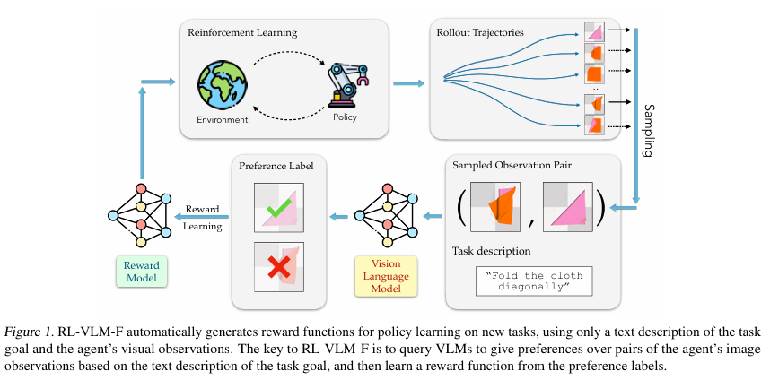 | [Github](https://github.com/yufeiwang63/RL-VLM-F) | <details><summary>bib.tex</summary><pre><code class="language-bibtex">@inproceedings{wang2024rlvlmf,<br>  title={RL-VLM-F: Reinforcement Learning from Vision Language Foundation Model Feedback},<br>  author={Wang, Yufei and Sun, Zhanyi and Zhang, Jesse and Xian, Zhou and Biyik, Erdem and Held, David and Erickson, Zackory},<br>  booktitle={Proceedings of the 41st International Conference on Machine Learning},<br>  pages={51484--51501},<br>  year={2024},<br>  volume={235},<br>  series={Proceedings of Machine Learning Research},<br>  url={https://proceedings.mlr.press/v235/wang24bn.html}<br>}</code></pre></details> |
| 2024/02  |  <br/> [Code as Reward: Empowering Reinforcement Learning with VLMs](https://arxiv.org/abs/2402.04764) | 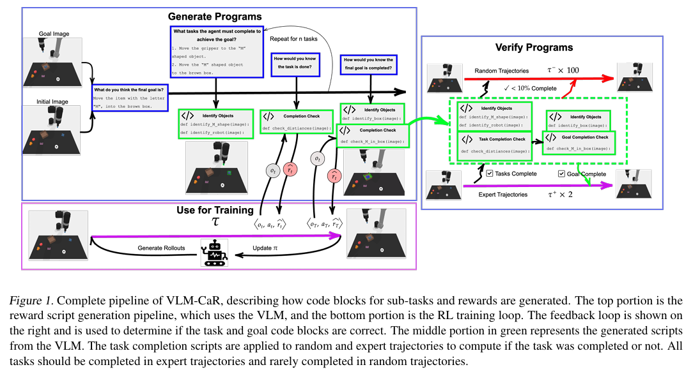 | [Github](https://github.com/dvVenuto/vlm-car) | <details><summary>bib.tex</summary><pre><code class="language-bibtex">@inproceedings{venuto2024code,<br>  title={Code as Reward: Empowering Reinforcement Learning with VLMs},<br>  author={Venuto, David and Islam, Mohammad Sami Nur and Klissarov, Martin and Precup, Doina and Yang, Sherry and Anand, Ankit},<br>  booktitle={Proceedings of the 41st International Conference on Machine Learning},<br>  year={2024}<br>}</code></pre></details> |
| 2023/12 | [Video Prediction Models as Rewards for Reinforcement Learning](https://papers.nips.cc/paper_files/paper/2023/hash/d9042abf40782fbce28901c1c9c0e8d8-Abstract-Conference.html) | 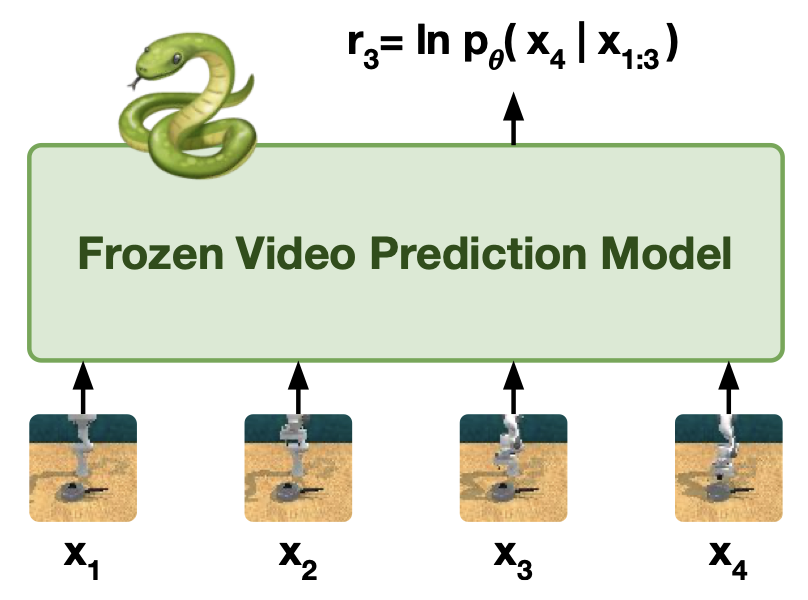 | [GitHub](https://github.com/Alescontrela/viper_rl) | <details><summary>bib.tex</summary><pre><code class="language-bibtex">@inproceedings{NEURIPS2023_d9042abf,<br>  author={Escontrela, Alejandro and Adeniji, Ademi and Yan, Wilson and Jain, Ajay and Peng, Xue Bin and Goldberg, Ken and Lee, Youngwoon and Hafner, Danijar and Abbeel, Pieter},<br>  booktitle={Advances in Neural Information Processing Systems},<br>  pages={68760--68783},<br>  publisher={Curran Associates, Inc.},<br>  title={Video Prediction Models as Rewards for Reinforcement Learning},<br>  url={https://proceedings.neurips.cc/paper_files/paper/2023/file/d9042abf40782fbce28901c1c9c0e8d8-Paper-Conference.pdf},<br>  volume={36},<br>  year={2023},<br>}</code></pre></details> |
| 2023/12  |  <br/> [Vision-Language Models as a Source of Rewards](https://arxiv.org/abs/2312.09187) | 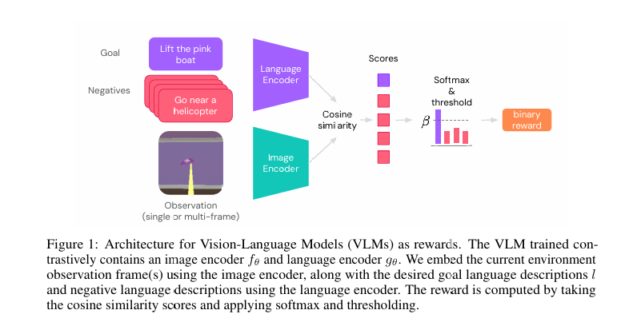 | - | <details><summary>bib.tex</summary><pre><code class="language-bibtex">@article{baumli2023visionlanguage,<br>  title={Vision-Language Models as a Source of Rewards},<br>  author={Baumli, Kate and Baveja, Satinder and Behbahani, Feryal and Chan, Harris and Comanici, Gheorghe and Flennerhag, Sebastian and Gazeau, Maxime and Holsheimer, Kristian and Horgan, Dan and Laskin, Michael and Lyle, Clare and Masoom, Hussain and McKinney, Kay and Mnih, Volodymyr and Neitz, Alexander and Nikulin, Dmitry and Pardo, Fabio and Parker-Holder, Jack and Quan, John and Rockt{\"a}schel, Tim and Sahni, Himanshu and Schaul, Tom and Schroecker, Yannick and Spencer, Stephen and Steigerwald, Richie and Wang, Luyu and Zhang, Lei},<br>  journal={arXiv preprint arXiv:2312.09187},<br>  year={2023}<br>}</code></pre></details> |
| 2023/10  |  <br/> [Vision-Language Models are Zero-Shot Reward Models for Reinforcement Learning](https://arxiv.org/abs/2310.12921) | 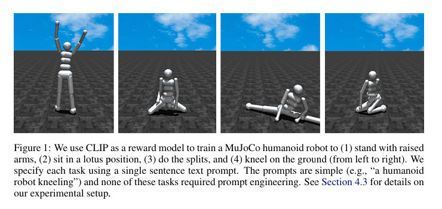 | [Github](https://github.com/AlignmentResearch/vlmrm) | <details><summary>bib.tex</summary><pre><code class="language-bibtex">@inproceedings{rocamonde2024visionlanguage,<br>  title={Vision-Language Models are Zero-Shot Reward Models for Reinforcement Learning},<br>  author={Rocamonde, Juan and Montesinos, Victoriano and Nava, Elvis and Perez, Ethan and Lindner, David},<br>  booktitle={The Twelfth International Conference on Learning Representations},<br>  year={2024},<br>  url={https://openreview.net/forum?id=N0I2RtD8je}<br>}</code></pre></details> |
| 2023/10  |  <br/> [Eureka: Human-Level Reward Design via Coding Large Language Models](https://arxiv.org/abs/2310.12931) | 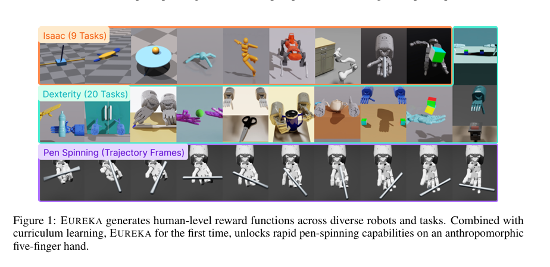 | [Github](https://github.com/eureka-research/Eureka) | <details><summary>bib.tex</summary><pre><code class="language-bibtex">@inproceedings{ma2024eureka,<br>  title={Eureka: Human-Level Reward Design via Coding Large Language Models},<br>  author={Ma, Yecheng Jason and Liang, William and Wang, Guanzhi and Huang, De-An and Bastani, Osbert and Jayaraman, Dinesh and Zhu, Yuke and Fan, Linxi and Anandkumar, Anima},<br>  booktitle={The Twelfth International Conference on Learning Representations},<br>  year={2024},<br>  url={https://openreview.net/forum?id=IEduRUO55F}<br>}</code></pre></details> |
| 2023/09  |  <br/> [Text2Reward: Reward Shaping with Language Models for Reinforcement Learning](https://arxiv.org/abs/2309.11489) | 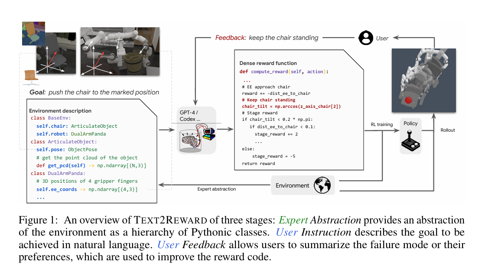 | [Github](https://github.com/xlang-ai/text2reward) | <details><summary>bib.tex</summary><pre><code class="language-bibtex">@inproceedings{xietext2reward,<br>  title={Text2Reward: Reward Shaping with Language Models for Reinforcement Learning},<br>  author={Xie, Tianbao and Zhao, Siheng and Wu, Chen Henry and Liu, Yitao and Luo, Qian and Zhong, Victor and Yang, Yanchao and Yu, Tao},<br>  booktitle={The Twelfth International Conference on Learning Representations},<br>  year={2024},<br>  url={https://openreview.net/forum?id=tUM39YTRxH}<br>}</code></pre></details> |
| 2023/07 | [LIV: Language-Image Representations and Rewards for Robotic Control](https://proceedings.mlr.press/v202/ma23b.html) | 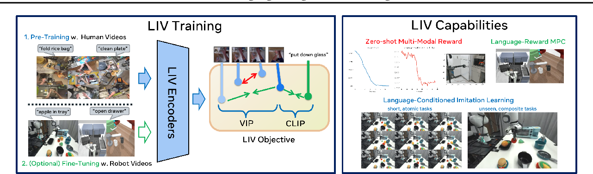 | [GitHub](https://github.com/penn-pal-lab/LIV) | <details><summary>bib.tex</summary><pre><code class="language-bibtex">@inproceedings{pmlr-v202-ma23b,<br>  title={{LIV}: Language-Image Representations and Rewards for Robotic Control},<br>  author={Ma, Yecheng Jason and Kumar, Vikash and Zhang, Amy and Bastani, Osbert and Jayaraman, Dinesh},<br>  booktitle={Proceedings of the 40th International Conference on Machine Learning},<br>  pages={23301--23320},<br>  year={2023},<br>  volume={202},<br>  series={Proceedings of Machine Learning Research},<br>  publisher={PMLR},<br>  url={https://proceedings.mlr.press/v202/ma23b.html},<br>}</code></pre></details> |
| 2023/06  |  <br/> [Language to Rewards for Robotic Skill Synthesis](https://proceedings.mlr.press/v229/yu23a.html) | 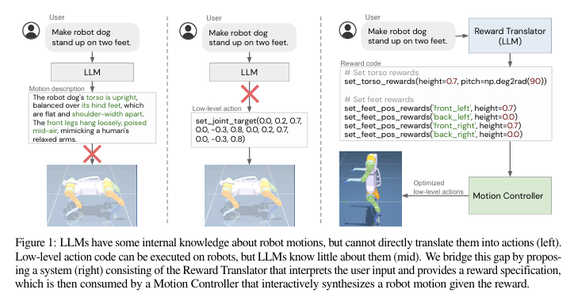 | [Github](https://github.com/google-deepmind/language_to_reward_2023) | <details><summary>bib.tex</summary><pre><code class="language-bibtex">@inproceedings{pmlr-v229-yu23a,<br>  title={Language to Rewards for Robotic Skill Synthesis},<br>  author={Yu, Wenhao and Gileadi, Nimrod and Fu, Chuyuan and Kirmani, Sean and Lee, Kuang-Huei and Gonzalez Arenas, Montserrat and Chiang, Hao-Tien Lewis and Erez, Tom and Hasenclever, Leonard and Humplik, Jan and Ichter, Brian and Xiao, Ted and Xu, Peng and Zeng, Andy and Zhang, Tingnan and Heess, Nicolas and Sadigh, Dorsa and Tan, Jie and Tassa, Yuval and Xia, Fei},<br>  booktitle={Proceedings of The 7th Conference on Robot Learning},<br>  pages={374--404},<br>  year={2023},<br>  editor={Tan, Jie and Toussaint, Marc and Darvish, Kourosh},<br>  volume={229},<br>  series={Proceedings of Machine Learning Research},<br>  publisher={PMLR},<br>  url={https://proceedings.mlr.press/v229/yu23a.html}<br>}</code></pre></details> |
| 2023/04  |  <br/> [The Internal State of an LLM Knows When It's Lying](https://arxiv.org/abs/2304.13734) | 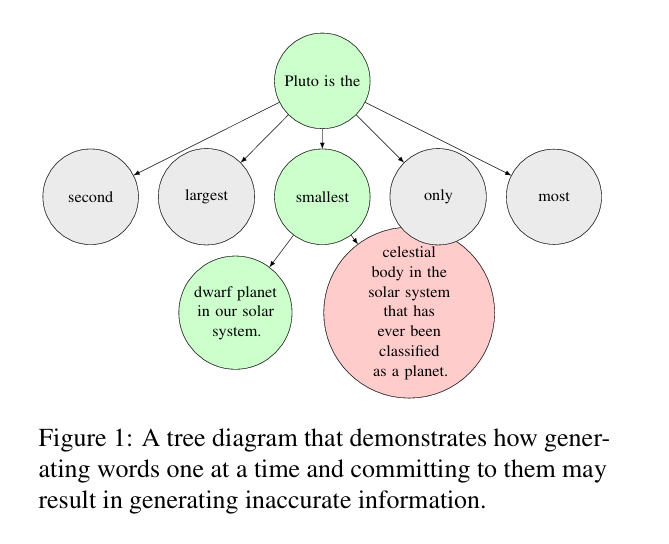 | - | <details><summary>bib.tex</summary><pre><code class="language-bibtex">@inproceedings{azaria-mitchell-2023-internal,<br>  title={The Internal State of an LLM Knows When It’s Lying},<br>  author={Azaria, Amos and Mitchell, Tom},<br>  booktitle={Findings of the Association for Computational Linguistics: EMNLP 2023},<br>  pages={967--976},<br>  year={2023},<br>  publisher={Association for Computational Linguistics},<br>  url={https://aclanthology.org/2023.findings-emnlp.68/}<br>}</code></pre></details> |
| 2023/03  |  <br/> [Vision-Language Models as Success Detectors](https://arxiv.org/abs/2303.07280) | 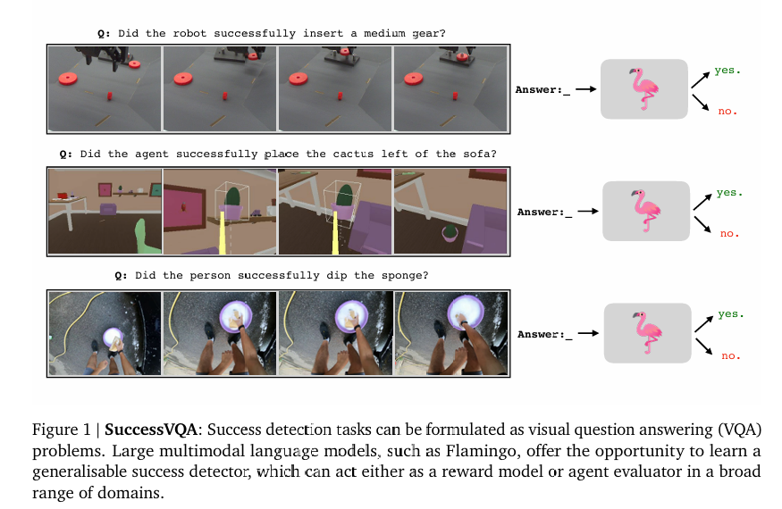 | - | <details><summary>bib.tex</summary><pre><code class="language-bibtex">@inproceedings{pmlr-v232-du23b,<br>  title={Vision-Language Models as Success Detectors},<br>  author={Du, Yuqing and Konyushkova, Ksenia and Denil, Misha and Raju, Akhil and Landon, Jessica and Hill, Felix and de Freitas, Nando and Cabi, Serkan},<br>  booktitle={Proceedings of The 2nd Conference on Lifelong Learning Agents},<br>  pages={120--136},<br>  year={2023},<br>  editor={Chandar, Sarath and Pascanu, Razvan and Sedghi, Hanie and Precup, Doina},<br>  volume={232},<br>  series={Proceedings of Machine Learning Research},<br>  publisher={PMLR},<br>  url={https://proceedings.mlr.press/v232/du23b.html}<br>}</code></pre></details> |
| 2022/12  |  <br/> [Discovering Latent Knowledge in Language Models Without Supervision](https://arxiv.org/abs/2212.03827) | 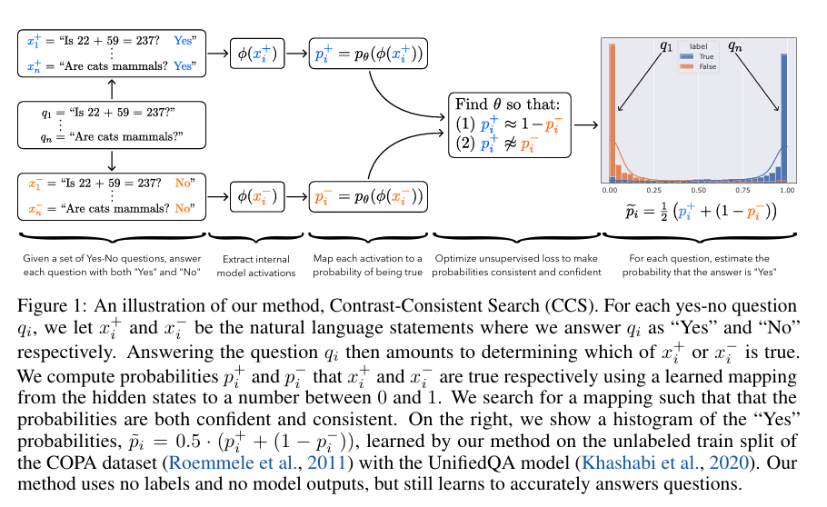 | [Github](https://github.com/collin-burns/discovering_latent_knowledge) | <details><summary>bib.tex</summary><pre><code class="language-bibtex">@inproceedings{burns2023discovering,<br>  title={Discovering Latent Knowledge in Language Models Without Supervision},<br>  author={Burns, Collin and Ye, Haotian and Klein, Dan and Steinhardt, Jacob},<br>  booktitle={The Eleventh International Conference on Learning Representations},<br>  year={2023},<br>  url={https://openreview.net/forum?id=ETKGuby0hcs}<br>}</code></pre></details> |
| 2022/10 | [VIP: Towards Universal Visual Reward and Representation via Value-Implicit Pre-Training](https://arxiv.org/abs/2210.00030) | 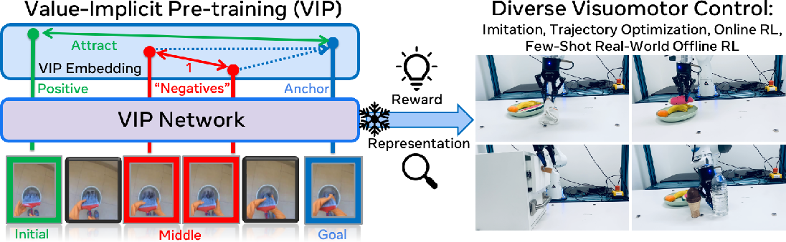 | [GitHub](https://github.com/facebookresearch/vip) | <details><summary>bib.tex</summary><pre><code class="language-bibtex">@misc{ma2023vipuniversalvisualreward,<br>  title={VIP: Towards Universal Visual Reward and Representation via Value-Implicit Pre-Training},<br>  author={Yecheng Jason Ma and Shagun Sodhani and Dinesh Jayaraman and Osbert Bastani and Vikash Kumar and Amy Zhang},<br>  year={2023},<br>  eprint={2210.00030},<br>  archivePrefix={arXiv},<br>  primaryClass={cs.RO},<br>  url={https://arxiv.org/abs/2210.00030},<br>}</code></pre></details> |
| 2022/07  |  <br/> [Zero-Shot Reward Specification via Grounded Natural Language](https://proceedings.mlr.press/v162/mahmoudieh22a.html) | 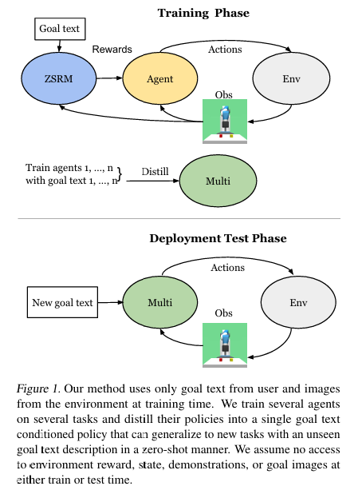 | - | <details><summary>bib.tex</summary><pre><code class="language-bibtex">@inproceedings{pmlr-v162-mahmoudieh22a,<br>  title={Zero-Shot Reward Specification via Grounded Natural Language},<br>  author={Mahmoudieh, Parsa and Pathak, Deepak and Darrell, Trevor},<br>  booktitle={Proceedings of the 39th International Conference on Machine Learning},<br>  pages={14743--14752},<br>  year={2022},<br>  editor={Chaudhuri, Kamalika and Jegelka, Stefanie and Song, Le and Szepesvari, Csaba and Niu, Gang and Sabato, Sivan},<br>  volume={162},<br>  series={Proceedings of Machine Learning Research},<br>  month={17--23 Jul},<br>  publisher={PMLR},<br>  url={https://proceedings.mlr.press/v162/mahmoudieh22a.html}<br>}</code></pre></details> |
| 2021/12 | [Generalizable Imitation Learning from Observation via Inferring Goal Proximity](https://papers.nips.cc/paper/2021/hash/868b7df964b1af24c8c0a9e43a330c6a-Abstract.html) | 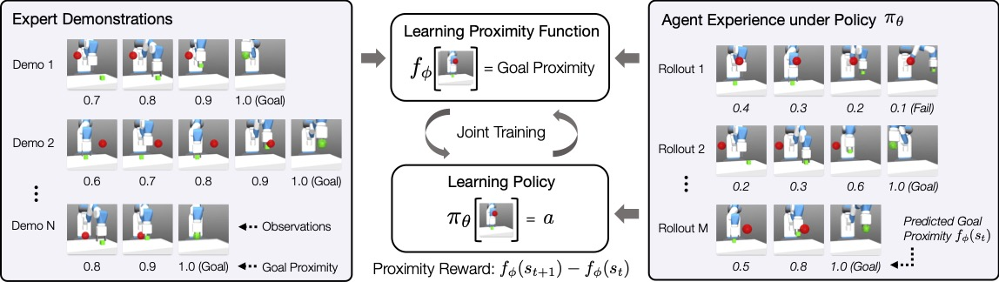 | [GitHub](https://github.com/clvrai/goal_prox_il) | <details><summary>bib.tex</summary><pre><code class="language-bibtex">@inproceedings{NEURIPS2021_868b7df9,<br>  author={Lee, Youngwoon and Szot, Andrew and Sun, Shao-Hua and Lim, Joseph J},<br>  booktitle={Advances in Neural Information Processing Systems},<br>  pages={16118--16130},<br>  publisher={Curran Associates, Inc.},<br>  title={Generalizable Imitation Learning from Observation via Inferring Goal Proximity},<br>  url={https://proceedings.neurips.cc/paper_files/paper/2021/file/868b7df964b1af24c8c0a9e43a330c6a-Paper.pdf},<br>  volume={34},<br>  year={2021},<br>}</code></pre></details> |
