<div align="center">

# Progress Reward Modeling for Robotic Learning

**A survey-aligned map of how robots can tell whether they are moving forward, standing still, or undoing progress.**

[](https://awesome.re)
[](LICENSE)
[](https://huggingface.co/papers/2607.21655)
[](https://arxiv.org/abs/2607.21655)
[](https://github.com/sterzhang/Awesome-Progress-Models)
[](https://github.com/sterzhang/Awesome-Progress-Models/stargazers)

</div>

A terminal success label only says whether the task finished. A progress model asks the harder question during execution: <em>is the robot advancing, stagnating, or regressing under the current goal?</em>

<p align="center">
  <a href="#survey-at-a-glance"><b>Survey map</b></a> ·
  <a href="#paper-gallery"><b>Paper gallery</b></a> ·
  <a href="#citation"><b>Citation</b></a> ·
  <a href="CONTRIBUTING.md"><b>Contribute</b></a>
</p>

<p align="center">
  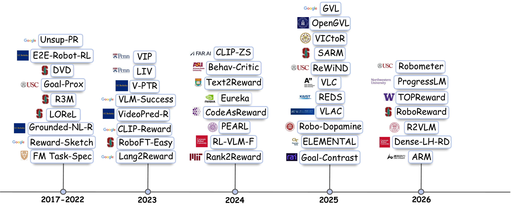
</p>

## Survey at a Glance

The paper follows one continuous path from definition to evidence. The README mirrors that path so every section can be traced back to the source.

| Survey layer | Question | Organization used in the paper |
|---|---|---|
| **1 · Interface** | What does the model receive and return? | current-state representation · task-goal specification · output form |
| **2 · Methods** | Where does the progress signal come from? | frozen foundation models · temporal/relative supervision · instruction tuning · programmatic rewards |
| **3 · Data & benchmarks** | How is supervision produced, and what does evaluation prove? | human-driven · human-in-the-loop · automated; fidelity · robustness/generalization · downstream utility |
| **4 · Limitations** | What still breaks in realistic use? | weak temporal assumptions · partial observability · calibration/generalization · closed-loop reliability |

## Quick Navigation

| Section | What to look for |
|---|---|
| [Interface](#interface) | The exact input/output design space from the survey. |
| [Construction paradigms](#construction-paradigms) | The four method families used in the paper. |
| [Paper Gallery](#paper-gallery) | Papers with venue, previews, code/project links, and BibTeX. |
| [Data & Benchmark Lens](#data--benchmark-lens) | How labels are built and what each evaluation actually validates. |
| [Limitations](#open-problems) | The paper's deployment-relevant open problems. |

## Interface

<p align="center">
  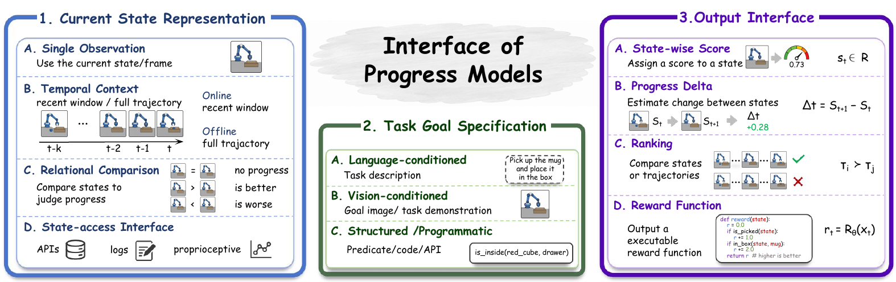
</p>

| Design axis | Choices in the paper | Core trade-off |
|---|---|---|
| **Current task state** | single observation · temporal context · relational comparison · state/API access | More context resolves ambiguity, but increases latency and weakens online usability. |
| **Task goal** | language · goal image or demonstration · structured/programmatic goal | Richer grounding reduces ambiguity, but needs more curation or privileged state. |
| **Model output** | state-wise score · progress delta · ranking · executable reward function | The output determines whether the model naturally fits monitoring, comparison, planning, or RL. |

## Construction Paradigms

<p align="center">
  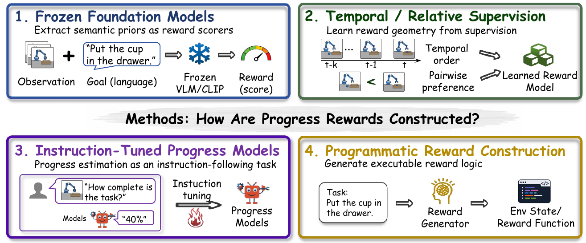
</p>

| Paradigm | Signal source | Strength | Main caveat |
|---|---|---|---|
| **Frozen foundation-model scoring** | image-text similarity, token probability, in-context value judgment | zero-shot use | semantic prior is not automatically a calibrated reward |
| **Temporal / relative supervision** | demonstration order, proximity, preferences, rankings | scalable weak supervision | time is not always progress; comparisons still need scalarization |
| **Instruction-tuned progress prediction** | explicit progress, success, delta, preference, or reasoning targets | dedicated progress capability | requires well-grounded targets and coverage of failures/regressions |
| **Programmatic reward construction** | generated code, predicates, features, APIs | interpretable and editable | only as faithful as the available state and task decomposition |

## Paper Gallery

Each row includes venue status, a visual preview when available, code/project links, and a collapsible BibTeX block.

### 1 · Instruction-Tuned Progress Prediction

Models explicitly trained to follow progress-related instructions: absolute progress, task success, signed deltas, preferences, or reasoning-grounded scores.

| Date / Venue | Paper | Preview | Links | Citation |
|---|---|---|---|---|
| 2026/04<br>arXiv'26 | [**ARM: Advantage Reward Modeling for Long-Horizon Manipulation**](https://arxiv.org/abs/2604.03037) | 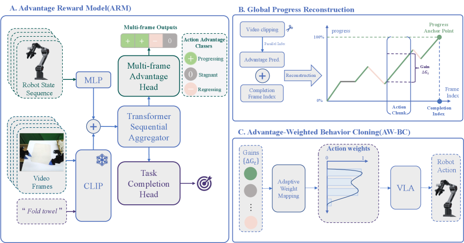 | - | <details><summary>bib.tex</summary><pre><code class="language-bibtex">@misc{mao2026armadvantagerewardmodeling,<br>  title={ARM: Advantage Reward Modeling for Long-Horizon Manipulation},<br>  author={Yiming Mao and Zixi Yu and Weixin Mao and Yinhao Li and Qirui Hu and Zihan Lan and Minzhao Zhu and Hua Chen},<br>  year={2026},<br>  eprint={2604.03037},<br>  archivePrefix={arXiv},<br>  primaryClass={cs.RO},<br>  url={https://arxiv.org/abs/2604.03037},<br>}</code></pre></details> |
| 2026/04<br>arXiv'26 | [**Generalizable Dense Reward for Long-Horizon Robotic Tasks**](https://arxiv.org/abs/2604.00055) | 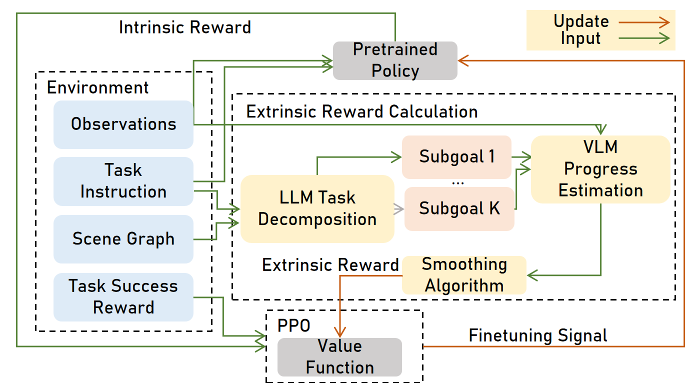 | - | <details><summary>bib.tex</summary><pre><code class="language-bibtex">@misc{yong2026generalizabledenserewardlonghorizon,<br>  title={Generalizable Dense Reward for Long-Horizon Robotic Tasks},<br>  author={Silong Yong and Stephen Sheng and Carl Qi and Xiaojie Wang and Evan Sheehan and Anurag Shivaprasad and Yaqi Xie and Katia Sycara and Yesh Dattatreya},<br>  year={2026},<br>  eprint={2604.00055},<br>  archivePrefix={arXiv},<br>  primaryClass={cs.RO},<br>  url={https://arxiv.org/abs/2604.00055},<br>}</code></pre></details> |
| 2026/03<br>arXiv'26 | [**Robometer: Scaling General-Purpose Robotic Reward Models via Trajectory Comparisons**](https://arxiv.org/abs/2603.02115) | 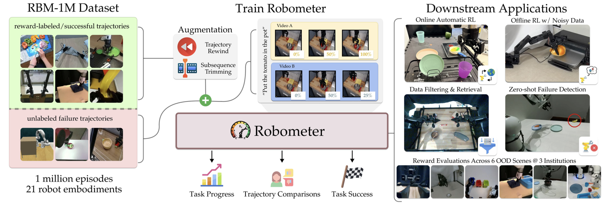 | [Code](https://github.com/robometer/robometer) | <details><summary>bib.tex</summary><pre><code class="language-bibtex">@misc{liang2026robometerscalinggeneralpurposerobotic,<br>  title={Robometer: Scaling General-Purpose Robotic Reward Models via Trajectory Comparisons},<br>  author={Anthony Liang and Yigit Korkmaz and Jiahui Zhang and Minyoung Hwang and Abrar Anwar and Sidhant Kaushik and Aditya Shah and Alex S. Huang and Luke Zettlemoyer and Dieter Fox and Yu Xiang and Anqi Li and Andreea Bobu and Abhishek Gupta and Stephen Tu and Erdem Biyik and Jesse Zhang},<br>  year={2026},<br>  eprint={2603.02115},<br>  archivePrefix={arXiv},<br>  primaryClass={cs.RO},<br>  url={https://arxiv.org/abs/2603.02115},<br>}</code></pre></details> |
| 2026/03<br>arXiv'26 | [**ProgressVLA: Progress-Guided Diffusion Policy for Vision-Language Robotic Manipulation**](https://arxiv.org/abs/2603.27670) | - | - | <details><summary>bib.tex</summary><pre><code class="language-bibtex">@misc{yan2026progressvlaprogressguideddiffusionpolicy,<br>  title={ProgressVLA: Progress-Guided Diffusion Policy for Vision-Language Robotic Manipulation},<br>  author={Hongyu Yan and Qiwei Li and Jiaolong Yang and Yadong Mu},<br>  year={2026},<br>  eprint={2603.27670},<br>  archivePrefix={arXiv},<br>  primaryClass={cs.RO},<br>  url={https://arxiv.org/abs/2603.27670},<br>}</code></pre></details> |
| 2026/03<br>arXiv'26 | [**Recurrent Reasoning with Vision-Language Models for Estimating Long-Horizon Embodied Task Progress**](https://arxiv.org/abs/2603.17312) | - | - | <details><summary>bib.tex</summary><pre><code class="language-bibtex">@misc{zhang2026recurrentreasoningvisionlanguagemodels,<br>  title={Recurrent Reasoning with Vision-Language Models for Estimating Long-Horizon Embodied Task Progress},<br>  author={Yuelin Zhang and Sijie Cheng and Chen Li and Zongzhao Li and Yuxin Huang and Yang Liu and Wenbing Huang},<br>  year={2026},<br>  eprint={2603.17312},<br>  archivePrefix={arXiv},<br>  primaryClass={cs.CV},<br>  url={https://arxiv.org/abs/2603.17312},<br>}</code></pre></details> |
| 2026/01<br>ACL'26 | [**PROGRESSLM: Towards Progress Reasoning in Vision-Language Models**](https://arxiv.org/abs/2601.15224) | 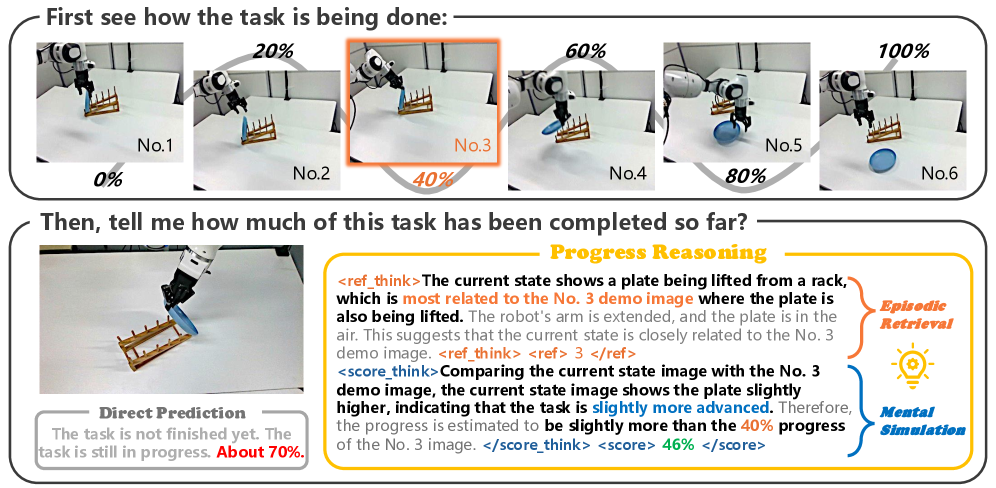 | [Code](https://github.com/ProgressLM/ProgressLM) | <details><summary>bib.tex</summary><pre><code class="language-bibtex">@misc{zhang2026progresslmprogressreasoningvisionlanguage,<br>  title={PROGRESSLM: Towards Progress Reasoning in Vision-Language Models},<br>  author={Jianshu Zhang and Chengxuan Qian and Haosen Sun and Haoran Lu and Dingcheng Wang and Letian Xue and Han Liu},<br>  year={2026},<br>  eprint={2601.15224},<br>  archivePrefix={arXiv},<br>  primaryClass={cs.CV},<br>  url={https://arxiv.org/abs/2601.15224},<br>}</code></pre></details> |
| 2026/01<br>arXiv'26 | [**RoboReward: General-Purpose Vision-Language Reward Models for Robotics**](https://arxiv.org/abs/2601.00675) | 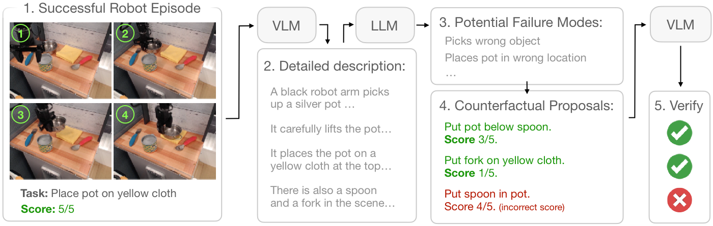 | [Project](https://crfm.stanford.edu/helm/robo-reward-bench/) | <details><summary>bib.tex</summary><pre><code class="language-bibtex">@misc{lee2026roborewardgeneralpurposevisionlanguagereward,<br>  title={RoboReward: General-Purpose Vision-Language Reward Models for Robotics},<br>  author={Tony Lee and Andrew Wagenmaker and Karl Pertsch and Percy Liang and Sergey Levine and Chelsea Finn},<br>  year={2026},<br>  eprint={2601.00675},<br>  archivePrefix={arXiv},<br>  primaryClass={cs.RO},<br>  url={https://arxiv.org/abs/2601.00675},<br>}</code></pre></details> |
| 2025/12<br>CVPR'26 | [**Robo-Dopamine: General Process Reward Modeling for High-Precision Robotic Manipulation**](https://arxiv.org/abs/2512.23703) | 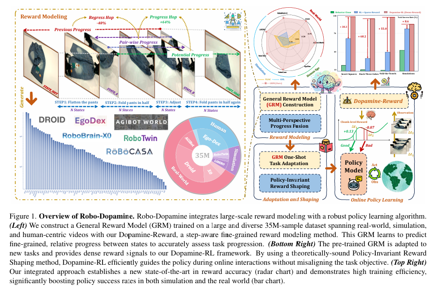 | [Code](https://github.com/FlagOpen/Robo-Dopamine) | <details><summary>bib.tex</summary><pre><code class="language-bibtex">@article{tan2025robo,<br>  title={Robo-Dopamine: General Process Reward Modeling for High-Precision Robotic Manipulation},<br>  author={Tan, Huajie and Chen, Sixiang and Xu, Yijie and Wang, Zixiao and Ji, Yuheng and Chi, Cheng and Lyu, Yaoxu and Zhao, Zhongxia and Chen, Xiansheng and Co, Peterson and Xie, Shaoxuan and Yao, Guocai and Wang, Pengwei and Wang, Zhongyuan and Zhang, Shanghang},<br>  journal={arXiv preprint arXiv:2512.23703},<br>  year={2025}<br>}</code></pre></details> |
| 2025/09<br>arXiv'25 | [**SARM: Stage-Aware Reward Modeling for Long Horizon Robot Manipulation**](https://arxiv.org/abs/2509.25358) | 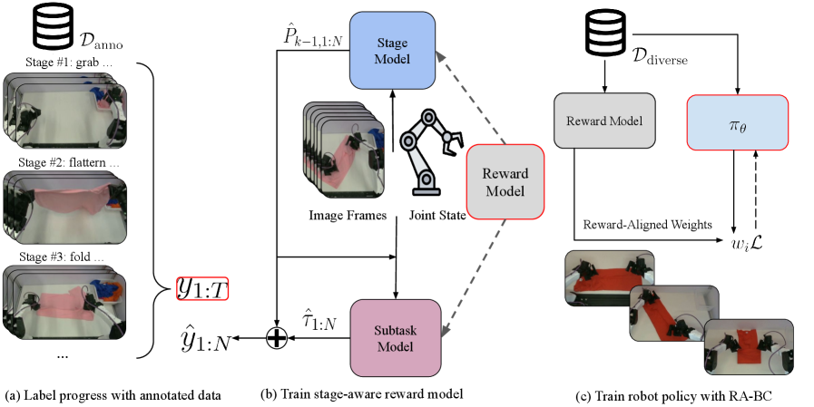 | [Code](https://github.com/xdofai/opensarm) | <details><summary>bib.tex</summary><pre><code class="language-bibtex">@misc{chen2025sarmstageawarerewardmodeling,<br>  title={SARM: Stage-Aware Reward Modeling for Long Horizon Robot Manipulation},<br>  author={Qianzhong Chen and Justin Yu and Mac Schwager and Pieter Abbeel and Yide Shentu and Philipp Wu},<br>  year={2025},<br>  eprint={2509.25358},<br>  archivePrefix={arXiv},<br>  primaryClass={cs.RO},<br>  url={https://arxiv.org/abs/2509.25358},<br>}</code></pre></details> |
| 2025/09<br>arXiv'25 | [**A Vision-Language-Action-Critic Model for Robotic Real-World Reinforcement Learning (VLAC)**](https://arxiv.org/abs/2509.15937) | 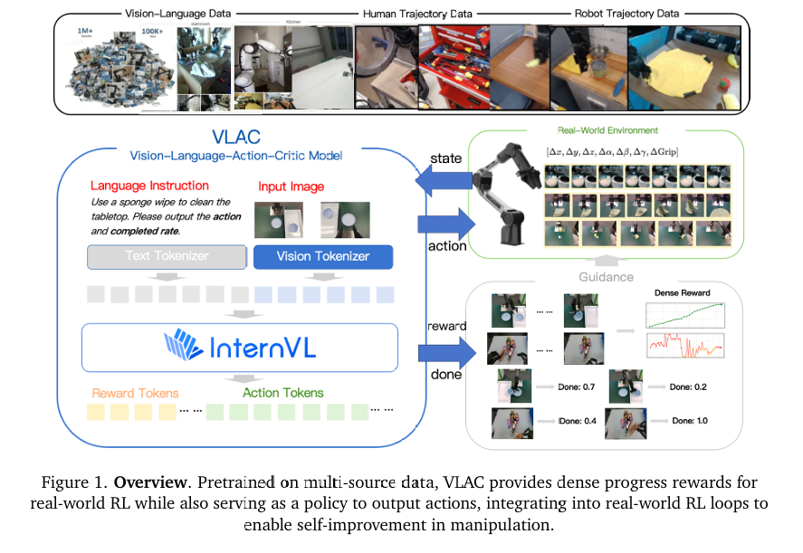 | [Code](https://github.com/InternRobotics/VLAC) | <details><summary>bib.tex</summary><pre><code class="language-bibtex">@article{zhai2025vision,<br>  title={A Vision-Language-Action-Critic Model for Robotic Real-World Reinforcement Learning},<br>  author={Zhai, Shaopeng and Zhang, Qi and Zhang, Tianyi and Huang, Fuxian and Zhang, Haoran and Zhou, Ming and Zhang, Shengzhe and Liu, Litao and Lin, Sixu and Pang, Jiangmiao},<br>  journal={arXiv preprint arXiv:2509.15937},<br>  year={2025}<br>}</code></pre></details> |
| 2025/05<br>arXiv'25 | [**ReWiND: Language-Guided Rewards Teach Robot Policies without New Demonstrations**](https://arxiv.org/abs/2505.10911) | 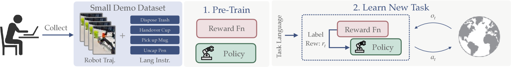 | [Code](https://github.com/rewind-reward/ReWiND) | <details><summary>bib.tex</summary><pre><code class="language-bibtex">@misc{zhang2025rewindlanguageguidedrewardsteach,<br>  title={ReWiND: Language-Guided Rewards Teach Robot Policies without New Demonstrations},<br>  author={Jiahui Zhang and Yusen Luo and Abrar Anwar and Sumedh Anand Sontakke and Joseph J Lim and Jesse Thomason and Erdem Biyik and Jesse Zhang},<br>  year={2025},<br>  eprint={2505.10911},<br>  archivePrefix={arXiv},<br>  primaryClass={cs.RO},<br>  url={https://arxiv.org/abs/2505.10911},<br>}</code></pre></details> |
| 2025/02<br>ICLR'25 | [**Subtask-Aware Visual Reward Learning from Segmented Demonstrations**](https://arxiv.org/abs/2502.20630) | 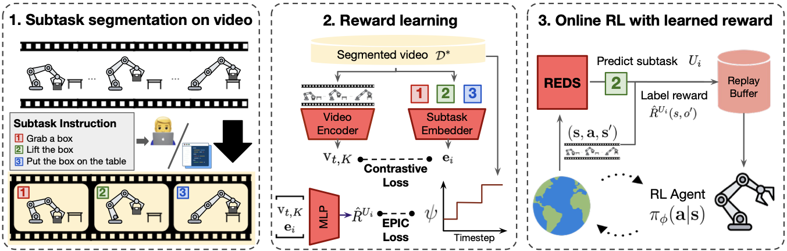 | [Code](https://github.com/csmile-1006/REDS_agent) | <details><summary>bib.tex</summary><pre><code class="language-bibtex">@inproceedings{kim2025subtask,<br>  title={Subtask-Aware Visual Reward Learning from Segmented Demonstrations},<br>  author={Kim, Changyeon and Heo, Minho and Lee, Doohyun and Lee, Honglak and Shin, Jinwoo and Lim, Joseph J. and Lee, Kimin},<br>  booktitle={The Thirteenth International Conference on Learning Representations},<br>  year={2025},<br>  url={https://openreview.net/forum?id=mqKVe6F3Up}<br>}</code></pre></details> |
| 2024/05<br>ICLR'25 | [**VICtoR: Learning Hierarchical Vision-Instruction Correlation Rewards for Long-horizon Manipulation**](https://arxiv.org/abs/2405.16545) | 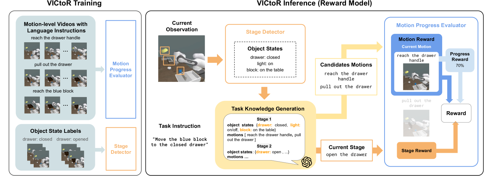 | [Code](https://github.com/cmlab-victor/victor-code) | <details><summary>bib.tex</summary><pre><code class="language-bibtex">@inproceedings{hung2025victor,<br>  title={VICtoR: Learning Hierarchical Vision-Instruction Correlation Rewards for Long-horizon Manipulation},<br>  author={Hung, Kuo-Han and Lo, Pang-Chi and Yeh, Jia-Fong and Hsu, Han-Yuan and Chen, Yi-Ting and Hsu, Winston H.},<br>  booktitle={The Thirteenth International Conference on Learning Representations},<br>  year={2025},<br>  url={https://openreview.net/forum?id=UpQLu9bzAR}<br>}</code></pre></details> |

### 2 · Frozen Foundation Models as Semantic Scorers

Zero-shot or in-context signals extracted from pretrained VLM/foundation models for reward, success, value, temporal progress, and behavior criticism.

| Date / Venue | Paper | Preview | Links | Citation |
|---|---|---|---|---|
| 2026/02<br>arXiv'26 | [**TOPReward: Token Probabilities as Hidden Zero-Shot Rewards for Robotics**](https://arxiv.org/abs/2602.19313) | 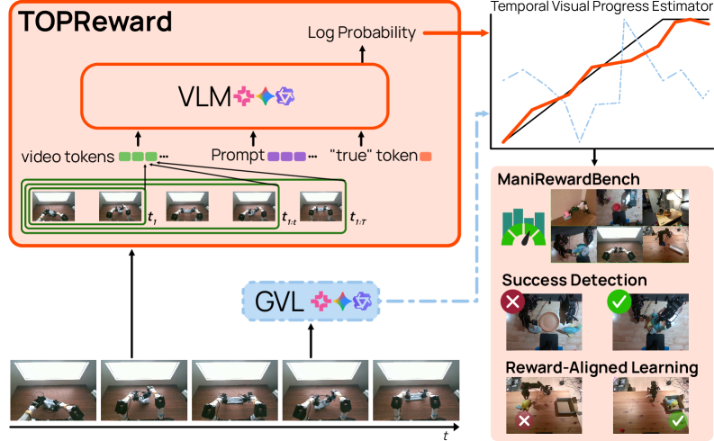 | [Code](https://github.com/TOPReward/TOPReward) | <details><summary>bib.tex</summary><pre><code class="language-bibtex">@misc{chen2026toprewardtokenprobabilitieshidden,<br>  title={TOPReward: Token Probabilities as Hidden Zero-Shot Rewards for Robotics},<br>  author={Shirui Chen and Cole Harrison and Ying-Chun Lee and Angela Jin Yang and Zhongzheng Ren and Lillian J. Ratliff and Jiafei Duan and Dieter Fox and Ranjay Krishna},<br>  year={2026},<br>  eprint={2602.19313},<br>  archivePrefix={arXiv},<br>  primaryClass={cs.RO},<br>  url={https://arxiv.org/abs/2602.19313},<br>}</code></pre></details> |
| 2025/09<br>arXiv'25 | [**OpenGVL -- Benchmarking Visual Temporal Progress for Data Curation**](https://arxiv.org/abs/2509.17321) | 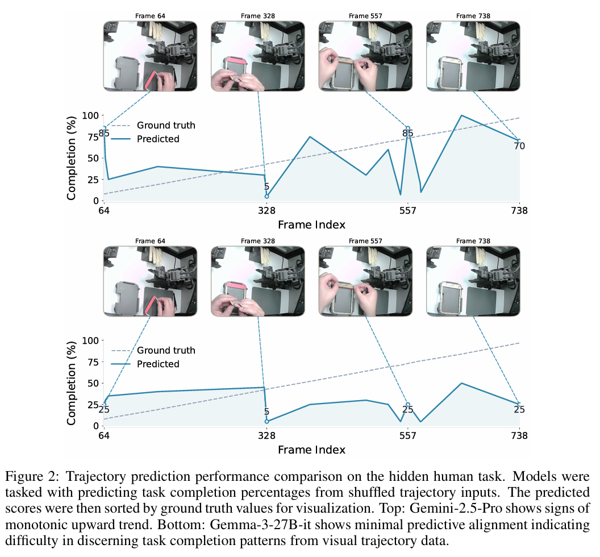 | [Code](https://github.com/budzianowski/opengvl) | <details><summary>bib.tex</summary><pre><code class="language-bibtex">@article{budzianowski2025opengvl,<br>  title={OpenGVL -- Benchmarking Visual Temporal Progress for Data Curation},<br>  author={Budzianowski, Pawe{\l} and Wi{\'s}nios, Emilia and Tyrolski, Micha{\l} and G{\'o}ral, Gracjan and Kulakov, Igor and Petrenko, Viktor and Walas, Krzysztof},<br>  journal={arXiv preprint arXiv:2509.17321},<br>  year={2025}<br>}</code></pre></details> |
| 2024/11<br>ICLR'25 | [**Vision Language Models are In-Context Value Learners**](https://arxiv.org/abs/2411.04549) | 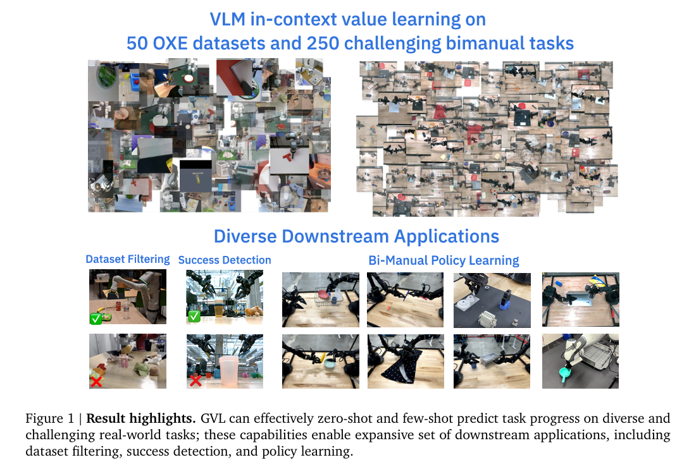 | - | <details><summary>bib.tex</summary><pre><code class="language-bibtex">@inproceedings{ma2025vision,<br>  title={Vision Language Models are In-Context Value Learners},<br>  author={Ma, Yecheng Jason and Hejna, Joey and Wahid, Ayzaan and Fu, Chuyuan and Shah, Dhruv and Liang, Jacky and Xu, Zhuo and Kirmani, Sean and Xu, Peng and Driess, Danny and Tompson, Jonathan and Bastani, Osbert and Jayaraman, Dinesh and Yu, Wenhao and Zhang, Tingnan and Sadigh, Dorsa and Xia, Fei},<br>  booktitle={The Thirteenth International Conference on Learning Representations},<br>  year={2025},<br>  url={https://openreview.net/forum?id=friHAl5ofG}<br>}</code></pre></details> |
| 2024/02<br>COLM'24 | [**"Task Success" Is Not Enough: Investigating the Use of Video-Language Models as Behavior Critics for Catching Undesirable Agent Behaviors**](https://arxiv.org/abs/2402.04210) | 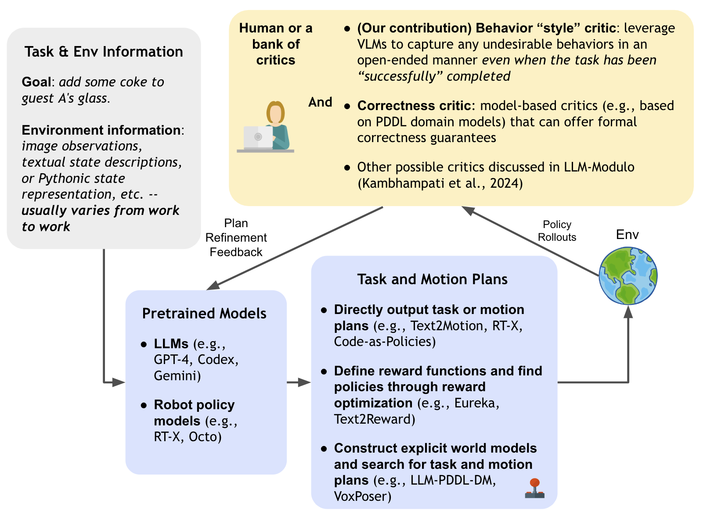 | [Code](https://github.com/GuanSuns/VLMs-Behavior-Critic) | <details><summary>bib.tex</summary><pre><code class="language-bibtex">@inproceedings{guan2024tasksuccess,<br>  title={{Task Success} is not Enough: Investigating the Use of Video-Language Models as Behavior Critics for Catching Undesirable Agent Behaviors},<br>  author={Guan, Lin and Zhou, Yifan and Liu, Denis and Zha, Yantian and Ben Amor, Heni and Kambhampati, Subbarao},<br>  booktitle={First Conference on Language Modeling},<br>  year={2024},<br>  url={https://openreview.net/forum?id=otKo4zFKmH}<br>}</code></pre></details> |
| 2023/12<br>arXiv'23 | [**Vision-Language Models as a Source of Rewards**](https://arxiv.org/abs/2312.09187) | 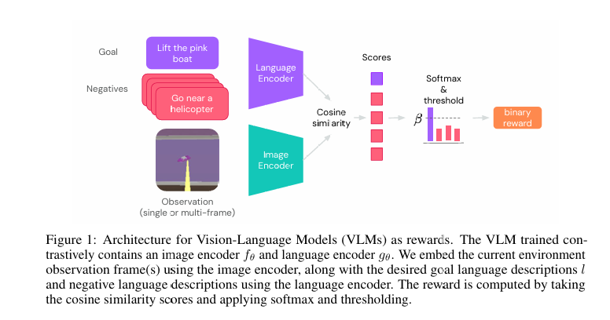 | - | <details><summary>bib.tex</summary><pre><code class="language-bibtex">@article{baumli2023visionlanguage,<br>  title={Vision-Language Models as a Source of Rewards},<br>  author={Baumli, Kate and Baveja, Satinder and Behbahani, Feryal and Chan, Harris and Comanici, Gheorghe and Flennerhag, Sebastian and Gazeau, Maxime and Holsheimer, Kristian and Horgan, Dan and Laskin, Michael and Lyle, Clare and Masoom, Hussain and McKinney, Kay and Mnih, Volodymyr and Neitz, Alexander and Nikulin, Dmitry and Pardo, Fabio and Parker-Holder, Jack and Quan, John and Rockt{\"a}schel, Tim and Sahni, Himanshu and Schaul, Tom and Schroecker, Yannick and Spencer, Stephen and Steigerwald, Richie and Wang, Luyu and Zhang, Lei},<br>  journal={arXiv preprint arXiv:2312.09187},<br>  year={2023}<br>}</code></pre></details> |
| 2023/10<br>ICLR'24 | [**Vision-Language Models are Zero-Shot Reward Models for Reinforcement Learning**](https://arxiv.org/abs/2310.12921) | 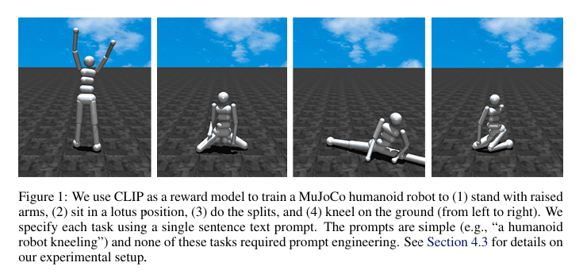 | [Code](https://github.com/AlignmentResearch/vlmrm) | <details><summary>bib.tex</summary><pre><code class="language-bibtex">@inproceedings{rocamonde2024visionlanguage,<br>  title={Vision-Language Models are Zero-Shot Reward Models for Reinforcement Learning},<br>  author={Rocamonde, Juan and Montesinos, Victoriano and Nava, Elvis and Perez, Ethan and Lindner, David},<br>  booktitle={The Twelfth International Conference on Learning Representations},<br>  year={2024},<br>  url={https://openreview.net/forum?id=N0I2RtD8je}<br>}</code></pre></details> |
| 2023/03<br>CoLLAs'23 | [**Vision-Language Models as Success Detectors**](https://arxiv.org/abs/2303.07280) | 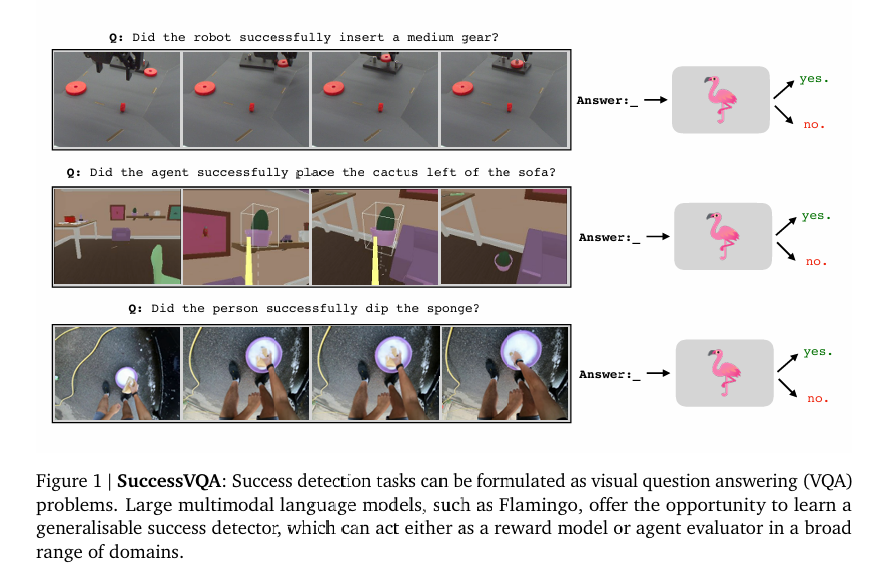 | - | <details><summary>bib.tex</summary><pre><code class="language-bibtex">@inproceedings{pmlr-v232-du23b,<br>  title={Vision-Language Models as Success Detectors},<br>  author={Du, Yuqing and Konyushkova, Ksenia and Denil, Misha and Raju, Akhil and Landon, Jessica and Hill, Felix and de Freitas, Nando and Cabi, Serkan},<br>  booktitle={Proceedings of The 2nd Conference on Lifelong Learning Agents},<br>  pages={120--136},<br>  year={2023},<br>  editor={Chandar, Sarath and Pascanu, Razvan and Sedghi, Hanie and Precup, Doina},<br>  volume={232},<br>  series={Proceedings of Machine Learning Research},<br>  publisher={PMLR},<br>  url={https://proceedings.mlr.press/v232/du23b.html}<br>}</code></pre></details> |
| 2022/07<br>ICML'22 | [**Zero-Shot Reward Specification via Grounded Natural Language**](https://proceedings.mlr.press/v162/mahmoudieh22a.html) | 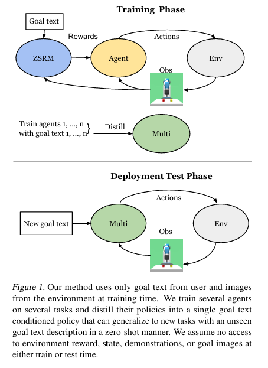 | - | <details><summary>bib.tex</summary><pre><code class="language-bibtex">@inproceedings{pmlr-v162-mahmoudieh22a,<br>  title={Zero-Shot Reward Specification via Grounded Natural Language},<br>  author={Mahmoudieh, Parsa and Pathak, Deepak and Darrell, Trevor},<br>  booktitle={Proceedings of the 39th International Conference on Machine Learning},<br>  pages={14743--14752},<br>  year={2022},<br>  editor={Chaudhuri, Kamalika and Jegelka, Stefanie and Song, Le and Szepesvari, Csaba and Niu, Gang and Sabato, Sivan},<br>  volume={162},<br>  series={Proceedings of Machine Learning Research},<br>  month={17--23 Jul},<br>  publisher={PMLR},<br>  url={https://proceedings.mlr.press/v162/mahmoudieh22a.html}<br>}</code></pre></details> |
| 2022/04<br>L4DC'22 | [**Can Foundation Models Perform Zero-Shot Task Specification for Robot Manipulation?**](https://arxiv.org/abs/2204.11134) | 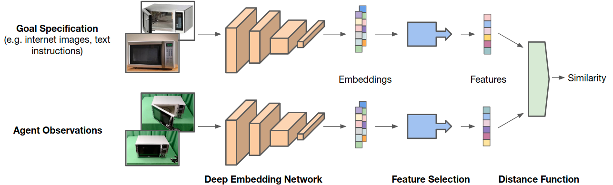 | [Project](https://sites.google.com/view/zestproject) | <details><summary>bib.tex</summary><pre><code class="language-bibtex">@inproceedings{pmlr-v168-cui22a,<br>  title={Can Foundation Models Perform Zero-Shot Task Specification For Robot Manipulation?},<br>  author={Cui, Yuchen and Niekum, Scott and Gupta, Abhinav and Kumar, Vikash and Rajeswaran, Aravind},<br>  booktitle={Proceedings of The 4th Annual Learning for Dynamics and Control Conference},<br>  pages={893--905},<br>  year={2022},<br>  volume={168},<br>  series={Proceedings of Machine Learning Research},<br>  publisher={PMLR},<br>  url={https://proceedings.mlr.press/v168/cui22a.html}<br>}</code></pre></details> |

### 3 · Learning from Temporal and Relative Supervision

Temporal order, passive video, goal proximity, value-like representations, and learned visual features.

| Date / Venue | Paper | Preview | Links | Citation |
|---|---|---|---|---|
| 2024/05<br>arXiv'25 | [**Video-Language Critic: Transferable Reward Functions for Language-Conditioned Robotics**](https://arxiv.org/abs/2405.19988) | 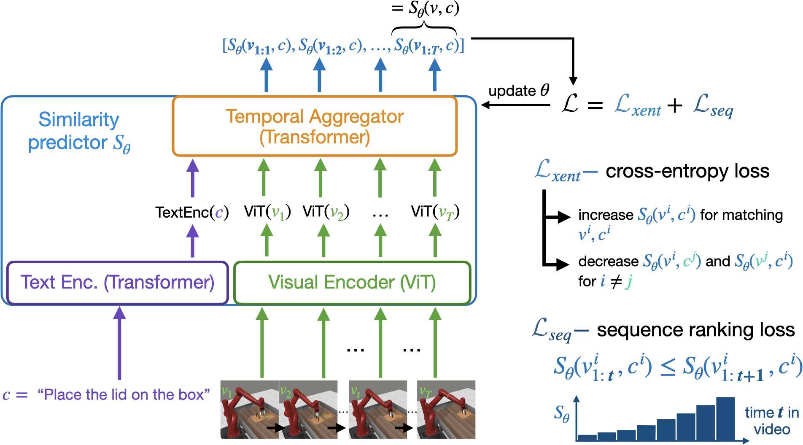 | [Code](https://github.com/minttusofia/video_language_critic) | <details><summary>bib.tex</summary><pre><code class="language-bibtex">@misc{alakuijala2025videolanguagecritictransferablereward,<br>  title={Video-Language Critic: Transferable Reward Functions for Language-Conditioned Robotics},<br>  author={Minttu Alakuijala and Reginald McLean and Isaac Woungang and Nariman Farsad and Samuel Kaski and Pekka Marttinen and Kai Yuan},<br>  year={2025},<br>  eprint={2405.19988},<br>  archivePrefix={arXiv},<br>  primaryClass={cs.RO},<br>  url={https://arxiv.org/abs/2405.19988},<br>}</code></pre></details> |
| 2024/04<br>arXiv'24 | [**Rank2Reward: Learning Shaped Reward Functions from Passive Video**](https://arxiv.org/abs/2404.14735) |  | [Code](https://github.com/dxyang/rank2reward) | <details><summary>bib.tex</summary><pre><code class="language-bibtex">@misc{yang2024rank2rewardlearningshapedreward,<br>  title={Rank2Reward: Learning Shaped Reward Functions from Passive Video},<br>  author={Daniel Yang and Davin Tjia and Jacob Berg and Dima Damen and Pulkit Agrawal and Abhishek Gupta},<br>  year={2024},<br>  eprint={2404.14735},<br>  archivePrefix={arXiv},<br>  primaryClass={cs.RO},<br>  url={https://arxiv.org/abs/2404.14735},<br>}</code></pre></details> |
| 2023/12<br>NeurIPS'23 | [**Video Prediction Models as Rewards for Reinforcement Learning**](https://papers.nips.cc/paper_files/paper/2023/hash/d9042abf40782fbce28901c1c9c0e8d8-Abstract-Conference.html) | 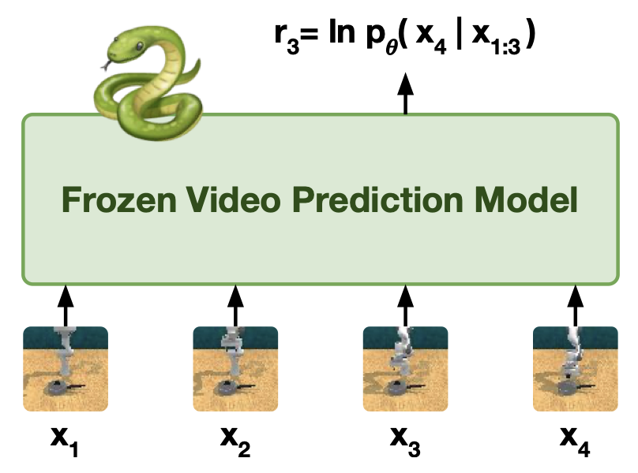 | [Code](https://github.com/Alescontrela/viper_rl) | <details><summary>bib.tex</summary><pre><code class="language-bibtex">@inproceedings{NEURIPS2023_d9042abf,<br>  author={Escontrela, Alejandro and Adeniji, Ademi and Yan, Wilson and Jain, Ajay and Peng, Xue Bin and Goldberg, Ken and Lee, Youngwoon and Hafner, Danijar and Abbeel, Pieter},<br>  booktitle={Advances in Neural Information Processing Systems},<br>  pages={68760--68783},<br>  publisher={Curran Associates, Inc.},<br>  title={Video Prediction Models as Rewards for Reinforcement Learning},<br>  url={https://proceedings.neurips.cc/paper_files/paper/2023/file/d9042abf40782fbce28901c1c9c0e8d8-Paper-Conference.pdf},<br>  volume={36},<br>  year={2023},<br>}</code></pre></details> |
| 2023/09<br>arXiv'23 | [**Robotic Offline RL from Internet Videos via Value-Function Pre-Training**](https://arxiv.org/abs/2309.13041) | 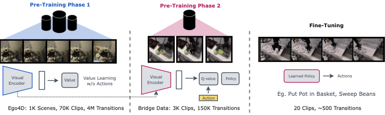 | - | <details><summary>bib.tex</summary><pre><code class="language-bibtex">@misc{bhateja2023roboticofflinerlinternet,<br>  title={Robotic Offline RL from Internet Videos via Value-Function Pre-Training},<br>  author={Chethan Bhateja and Derek Guo and Dibya Ghosh and Anikait Singh and Manan Tomar and Quan Vuong and Yevgen Chebotar and Sergey Levine and Aviral Kumar},<br>  year={2023},<br>  eprint={2309.13041},<br>  archivePrefix={arXiv},<br>  primaryClass={cs.RO},<br>  url={https://arxiv.org/abs/2309.13041},<br>}</code></pre></details> |
| 2023/07<br>ICML'23 | [**LIV: Language-Image Representations and Rewards for Robotic Control**](https://proceedings.mlr.press/v202/ma23b.html) | 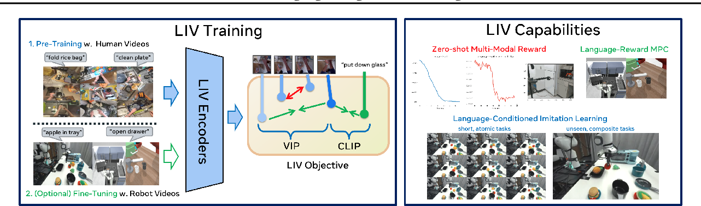 | [Code](https://github.com/penn-pal-lab/LIV) | <details><summary>bib.tex</summary><pre><code class="language-bibtex">@inproceedings{pmlr-v202-ma23b,<br>  title={{LIV}: Language-Image Representations and Rewards for Robotic Control},<br>  author={Ma, Yecheng Jason and Kumar, Vikash and Zhang, Amy and Bastani, Osbert and Jayaraman, Dinesh},<br>  booktitle={Proceedings of the 40th International Conference on Machine Learning},<br>  pages={23301--23320},<br>  year={2023},<br>  volume={202},<br>  series={Proceedings of Machine Learning Research},<br>  publisher={PMLR},<br>  url={https://proceedings.mlr.press/v202/ma23b.html},<br>}</code></pre></details> |
| 2022/10<br>arXiv'22 | [**VIP: Towards Universal Visual Reward and Representation via Value-Implicit Pre-Training**](https://arxiv.org/abs/2210.00030) | 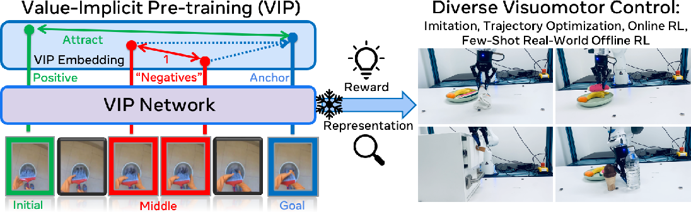 | [Code](https://github.com/facebookresearch/vip) | <details><summary>bib.tex</summary><pre><code class="language-bibtex">@misc{ma2023vipuniversalvisualreward,<br>  title={VIP: Towards Universal Visual Reward and Representation via Value-Implicit Pre-Training},<br>  author={Yecheng Jason Ma and Shagun Sodhani and Dinesh Jayaraman and Osbert Bastani and Vikash Kumar and Amy Zhang},<br>  year={2023},<br>  eprint={2210.00030},<br>  archivePrefix={arXiv},<br>  primaryClass={cs.RO},<br>  url={https://arxiv.org/abs/2210.00030},<br>}</code></pre></details> |
| 2022/03<br>CoRL'22 | [**R3M: A Universal Visual Representation for Robot Manipulation**](https://arxiv.org/abs/2203.12601) | 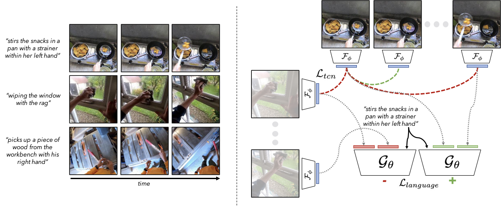 | [Code](https://github.com/facebookresearch/r3m) | <details><summary>bib.tex</summary><pre><code class="language-bibtex">@inproceedings{pmlr-v205-nair23a,<br>  title={{R3M}: A Universal Visual Representation for Robot Manipulation},<br>  author={Nair, Suraj and Rajeswaran, Aravind and Kumar, Vikash and Finn, Chelsea and Gupta, Abhinav},<br>  booktitle={Proceedings of The 6th Conference on Robot Learning},<br>  pages={892--909},<br>  year={2023},<br>  editor={Liu, Karen and Kulic, Dana and Ichnowski, Jeff},<br>  volume={205},<br>  series={Proceedings of Machine Learning Research},<br>  publisher={PMLR},<br>  url={https://proceedings.mlr.press/v205/nair23a.html},<br>}</code></pre></details> |
| 2021/12<br>NeurIPS'21 | [**Generalizable Imitation Learning from Observation via Inferring Goal Proximity**](https://papers.nips.cc/paper/2021/hash/868b7df964b1af24c8c0a9e43a330c6a-Abstract.html) | 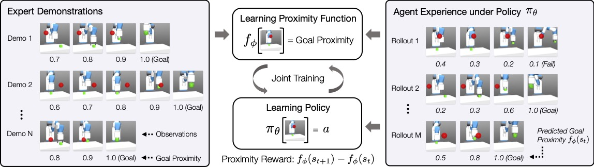 | [Code](https://github.com/clvrai/goal_prox_il) | <details><summary>bib.tex</summary><pre><code class="language-bibtex">@inproceedings{NEURIPS2021_868b7df9,<br>  author={Lee, Youngwoon and Szot, Andrew and Sun, Shao-Hua and Lim, Joseph J},<br>  booktitle={Advances in Neural Information Processing Systems},<br>  pages={16118--16130},<br>  publisher={Curran Associates, Inc.},<br>  title={Generalizable Imitation Learning from Observation via Inferring Goal Proximity},<br>  url={https://proceedings.neurips.cc/paper_files/paper/2021/file/868b7df964b1af24c8c0a9e43a330c6a-Paper.pdf},<br>  volume={34},<br>  year={2021},<br>}</code></pre></details> |
| 2021/03<br>arXiv'21 | [**Learning Generalizable Robotic Reward Functions from "In-The-Wild" Human Videos**](https://arxiv.org/abs/2103.16817) | 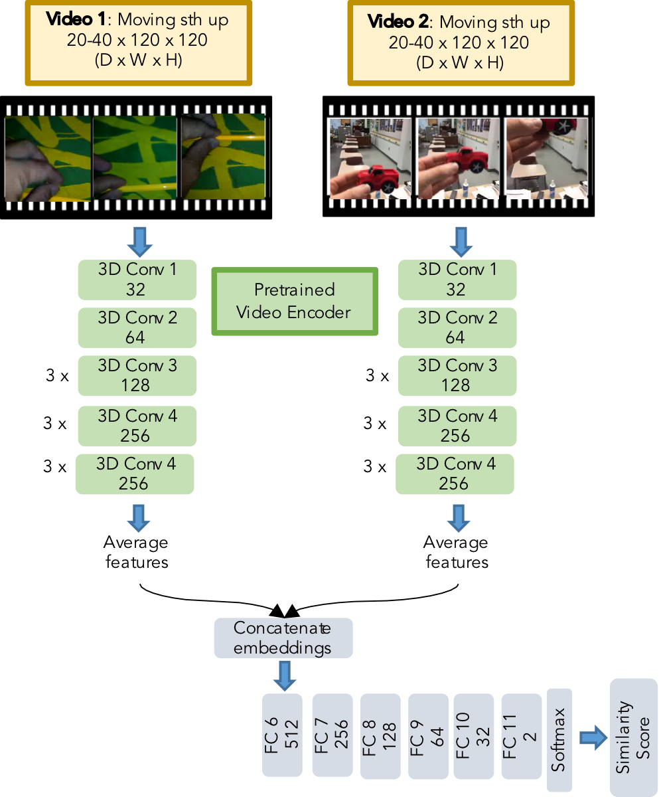 | [Code](https://github.com/anniesch/dvd) | <details><summary>bib.tex</summary><pre><code class="language-bibtex">@misc{chen2021learninggeneralizableroboticreward,<br>  title={Learning Generalizable Robotic Reward Functions from "In-The-Wild" Human Videos},<br>  author={Annie S. Chen and Suraj Nair and Chelsea Finn},<br>  year={2021},<br>  eprint={2103.16817},<br>  archivePrefix={arXiv},<br>  primaryClass={cs.RO},<br>  url={https://arxiv.org/abs/2103.16817},<br>}</code></pre></details> |
| 2016/12<br>RSS'17 | [**Unsupervised Perceptual Rewards for Imitation Learning**](https://arxiv.org/abs/1612.06699) | 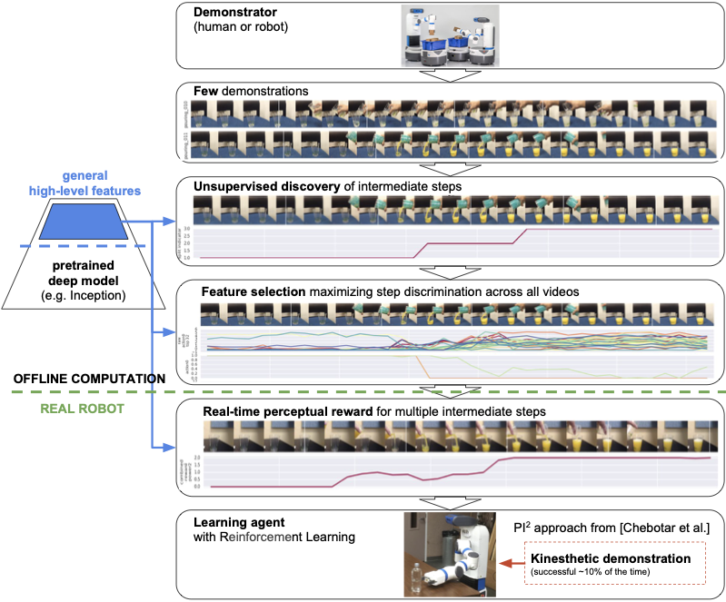 | [Project](https://sermanet.github.io/rewards/) | <details><summary>bib.tex</summary><pre><code class="language-bibtex">@misc{sermanet2017unsupervisedperceptualrewardsimitation,<br>  title={Unsupervised Perceptual Rewards for Imitation Learning},<br>  author={Pierre Sermanet and Kelvin Xu and Sergey Levine},<br>  year={2017},<br>  eprint={1612.06699},<br>  archivePrefix={arXiv},<br>  primaryClass={cs.CV},<br>  url={https://arxiv.org/abs/1612.06699},<br>}</code></pre></details> |

#### Relative branch · Preference, Contrastive, and Human-Feedback Rewards

Relative judgments, contrastive goals, endpoint labels, reward sketches, and human/crowd feedback.

| Date / Venue | Paper | Preview | Links | Citation |
|---|---|---|---|---|
| 2024/10<br>arXiv'25 | [**On-Robot Reinforcement Learning with Goal-Contrastive Rewards**](https://arxiv.org/abs/2410.19989) | 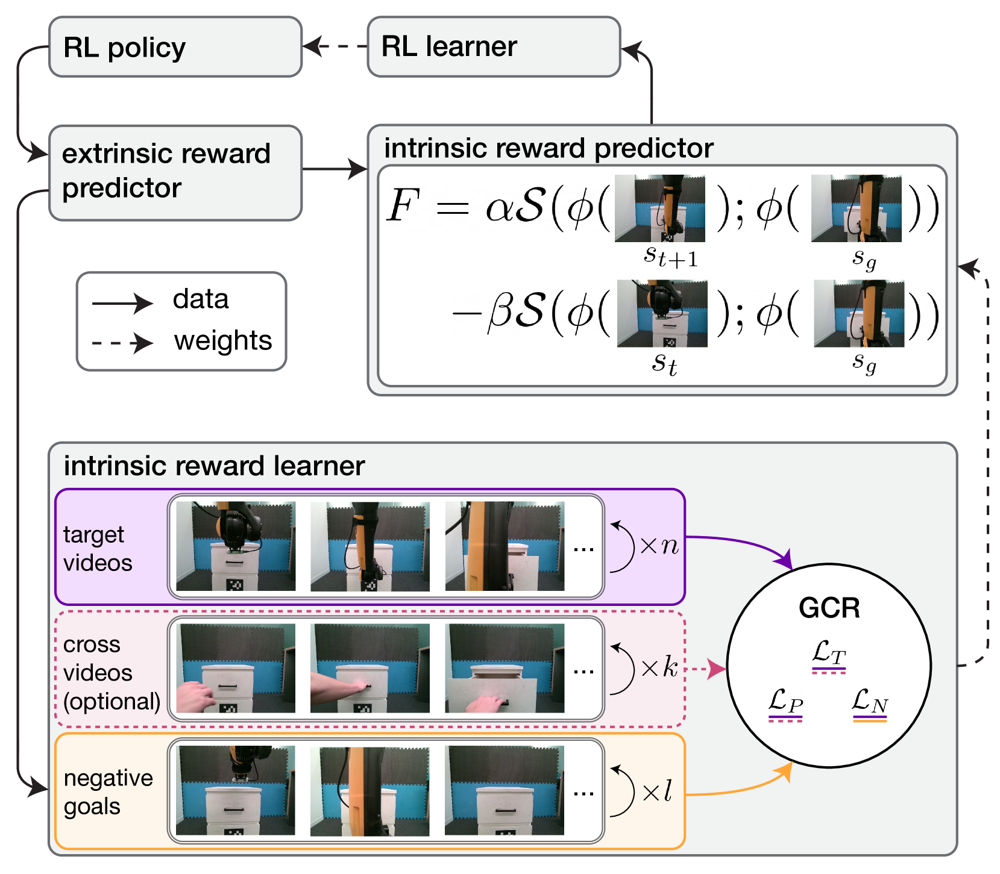 | - | <details><summary>bib.tex</summary><pre><code class="language-bibtex">@misc{biza2025onrobotreinforcementlearninggoalcontrastive,<br>  title={On-Robot Reinforcement Learning with Goal-Contrastive Rewards},<br>  author={Ondrej Biza and Thomas Weng and Lingfeng Sun and Karl Schmeckpeper and Tarik Kelestemur and Yecheng Jason Ma and Robert Platt and Jan-Willem van de Meent and Lawson L. S. Wong},<br>  year={2025},<br>  eprint={2410.19989},<br>  archivePrefix={arXiv},<br>  primaryClass={cs.RO},<br>  url={https://arxiv.org/abs/2410.19989},<br>}</code></pre></details> |
| 2024/02<br>ICML'24 | [**RL-VLM-F: Reinforcement Learning from Vision Language Foundation Model Feedback**](https://arxiv.org/abs/2402.03681) | 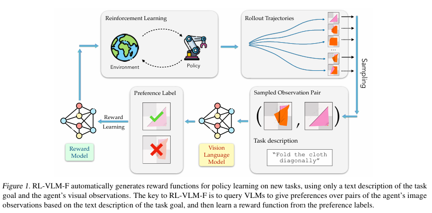 | [Code](https://github.com/yufeiwang63/RL-VLM-F) | <details><summary>bib.tex</summary><pre><code class="language-bibtex">@inproceedings{wang2024rlvlmf,<br>  title={RL-VLM-F: Reinforcement Learning from Vision Language Foundation Model Feedback},<br>  author={Wang, Yufei and Sun, Zhanyi and Zhang, Jesse and Xian, Zhou and Biyik, Erdem and Held, David and Erickson, Zackory},<br>  booktitle={Proceedings of the 41st International Conference on Machine Learning},<br>  pages={51484--51501},<br>  year={2024},<br>  volume={235},<br>  series={Proceedings of Machine Learning Research},<br>  url={https://proceedings.mlr.press/v235/wang24bn.html}<br>}</code></pre></details> |
| 2023/10<br>ICRA'24 | [**Robot Fine-Tuning Made Easy: Pre-Training Rewards and Policies for Autonomous Real-World Reinforcement Learning**](https://arxiv.org/abs/2310.15145) | 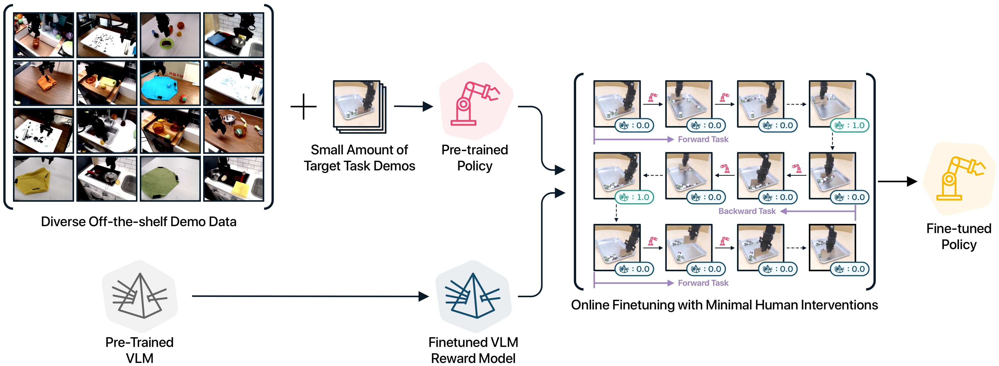 | [Project](https://robofume.github.io) | <details><summary>bib.tex</summary><pre><code class="language-bibtex">@misc{yang2023robotfinetuningeasypretraining,<br>  title={Robot Fine-Tuning Made Easy: Pre-Training Rewards and Policies for Autonomous Real-World Reinforcement Learning},<br>  author={Jingyun Yang and Max Sobol Mark and Brandon Vu and Archit Sharma and Jeannette Bohg and Chelsea Finn},<br>  year={2023},<br>  eprint={2310.15145},<br>  archivePrefix={arXiv},<br>  primaryClass={cs.RO},<br>  url={https://arxiv.org/abs/2310.15145},<br>}</code></pre></details> |
| 2023/06<br>ICML'24 | [**PEARL: Zero-Shot Cross-Task Preference Alignment and Robust Reward Learning for Robotic Manipulation**](https://arxiv.org/abs/2306.03615) | 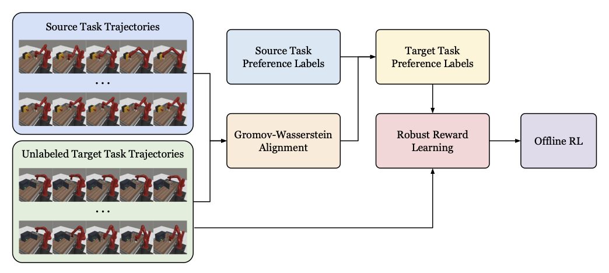 | [Project](https://sites.google.com/view/pearl-preference) | <details><summary>bib.tex</summary><pre><code class="language-bibtex">@inproceedings{pmlr-v235-liu24o,<br>  title={{PEARL}: Zero-shot Cross-task Preference Alignment and Robust Reward Learning for Robotic Manipulation},<br>  author={Liu, Runze and Du, Yali and Bai, Fengshuo and Lyu, Jiafei and Li, Xiu},<br>  booktitle={Proceedings of the 41st International Conference on Machine Learning},<br>  pages={30946--30964},<br>  year={2024},<br>  volume={235},<br>  series={Proceedings of Machine Learning Research},<br>  publisher={PMLR},<br>  url={https://proceedings.mlr.press/v235/liu24o.html}<br>}</code></pre></details> |
| 2021/09<br>CoRL'21 | [**Learning Language-Conditioned Robot Behavior from Offline Data and Crowd-Sourced Annotation**](https://arxiv.org/abs/2109.01115) | 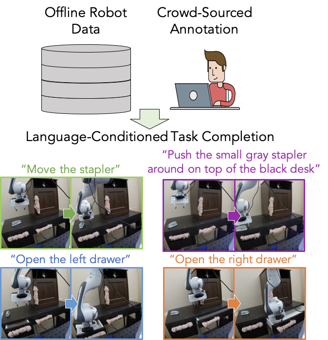 | [Project](https://sites.google.com/view/robotlorel) | <details><summary>bib.tex</summary><pre><code class="language-bibtex">@inproceedings{pmlr-v164-nair22a,<br>  title={Learning Language-Conditioned Robot Behavior from Offline Data and Crowd-Sourced Annotation},<br>  author={Nair, Suraj and Mitchell, Eric and Chen, Kevin and ichter, brian and Savarese, Silvio and Finn, Chelsea},<br>  booktitle={Proceedings of the 5th Conference on Robot Learning},<br>  pages={1303--1315},<br>  year={2022},<br>  volume={164},<br>  series={Proceedings of Machine Learning Research},<br>  publisher={PMLR},<br>  url={https://proceedings.mlr.press/v164/nair22a.html}<br>}</code></pre></details> |
| 2019/09<br>RSS'20 | [**Scaling Data-Driven Robotics with Reward Sketching and Batch Reinforcement Learning**](https://arxiv.org/abs/1909.12200) | 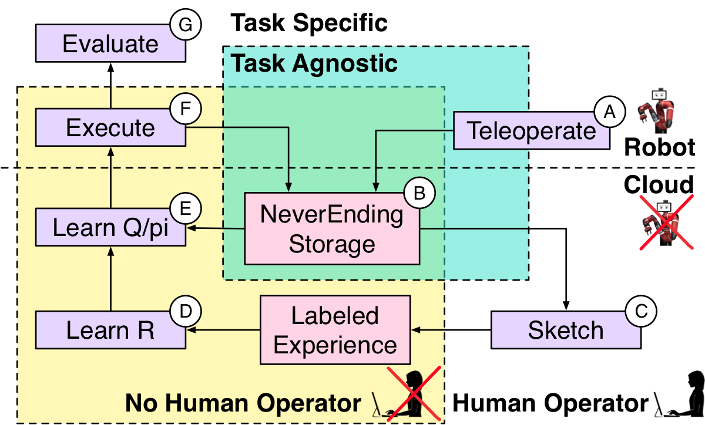 | [Project](https://sites.google.com/view/data-driven-robotics/) | <details><summary>bib.tex</summary><pre><code class="language-bibtex">@misc{cabi2020scalingdatadrivenroboticsreward,<br>  title={Scaling data-driven robotics with reward sketching and batch reinforcement learning},<br>  author={Serkan Cabi and Sergio G{\'o}mez Colmenarejo and Alexander Novikov and Ksenia Konyushkova and Scott Reed and Rae Jeong and Konrad Zolna and Yusuf Aytar and David Budden and Mel Vecerik and Oleg Sushkov and David Barker and Jonathan Scholz and Misha Denil and Nando de Freitas and Ziyu Wang},<br>  year={2020},<br>  eprint={1909.12200},<br>  archivePrefix={arXiv},<br>  primaryClass={cs.RO},<br>  url={https://arxiv.org/abs/1909.12200},<br>}</code></pre></details> |
| 2019/04<br>RSS'19 | [**End-to-End Robotic Reinforcement Learning without Reward Engineering**](https://arxiv.org/abs/1904.07854) | 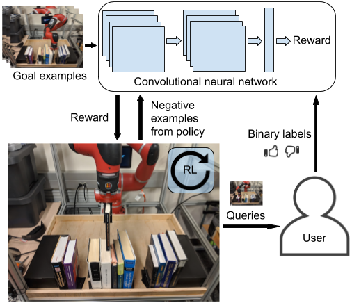 | [Code](https://github.com/avisingh599/reward-learning-rl) | <details><summary>bib.tex</summary><pre><code class="language-bibtex">@misc{singh2019endtoendroboticreinforcementlearning,<br>  title={End-to-End Robotic Reinforcement Learning without Reward Engineering},<br>  author={Avi Singh and Larry Yang and Kristian Hartikainen and Chelsea Finn and Sergey Levine},<br>  year={2019},<br>  eprint={1904.07854},<br>  archivePrefix={arXiv},<br>  primaryClass={cs.LG},<br>  url={https://arxiv.org/abs/1904.07854},<br>}</code></pre></details> |

### 4 · Programmatic Reward Construction

Stage decomposition, symbolic interfaces, generated reward functions, and executable reward logic.

| Date / Venue | Paper | Preview | Links | Citation |
|---|---|---|---|---|
| 2024/11<br>ICML'25 | [**ELEMENTAL: Interactive Learning from Demonstrations and Vision-Language Models for Reward Design in Robotics**](https://arxiv.org/abs/2411.18825) | 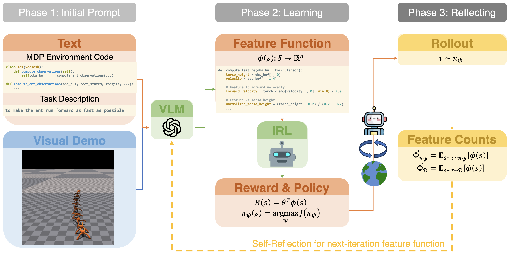 | - | <details><summary>bib.tex</summary><pre><code class="language-bibtex">@inproceedings{pmlr-v267-chen25at,<br>  title={{ELEMENTAL}: Interactive Learning from Demonstrations and Vision-Language Models for Reward Design in Robotics},<br>  author={Chen, Letian and Moorman, Nina Marie and Gombolay, Matthew Craig},<br>  booktitle={Proceedings of the 42nd International Conference on Machine Learning},<br>  pages={8700--8725},<br>  year={2025},<br>  volume={267},<br>  series={Proceedings of Machine Learning Research},<br>  publisher={PMLR},<br>  url={https://proceedings.mlr.press/v267/chen25at.html}<br>}</code></pre></details> |
| 2024/02<br>ICML'24 | [**Code as Reward: Empowering Reinforcement Learning with VLMs**](https://arxiv.org/abs/2402.04764) | 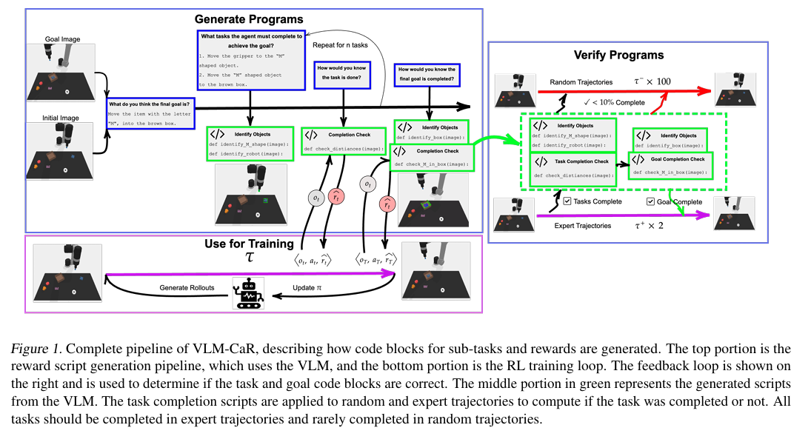 | [Code](https://github.com/dvVenuto/vlm-car) | <details><summary>bib.tex</summary><pre><code class="language-bibtex">@inproceedings{venuto2024code,<br>  title={Code as Reward: Empowering Reinforcement Learning with VLMs},<br>  author={Venuto, David and Islam, Mohammad Sami Nur and Klissarov, Martin and Precup, Doina and Yang, Sherry and Anand, Ankit},<br>  booktitle={Proceedings of the 41st International Conference on Machine Learning},<br>  year={2024}<br>}</code></pre></details> |
| 2023/10<br>ICLR'24 | [**Eureka: Human-Level Reward Design via Coding Large Language Models**](https://arxiv.org/abs/2310.12931) | 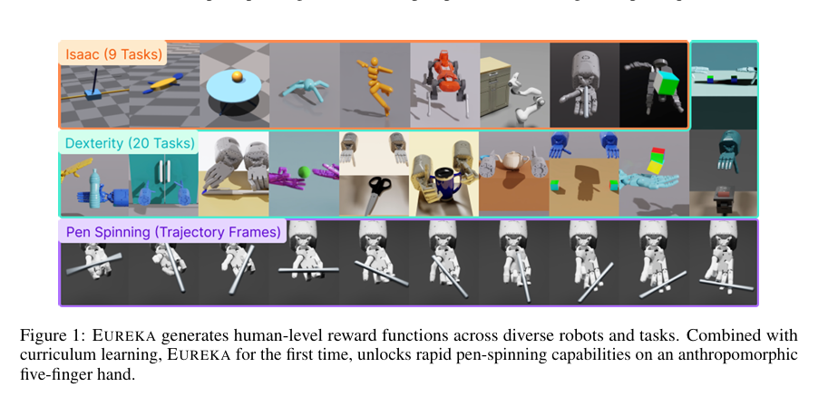 | [Code](https://github.com/eureka-research/Eureka) | <details><summary>bib.tex</summary><pre><code class="language-bibtex">@inproceedings{ma2024eureka,<br>  title={Eureka: Human-Level Reward Design via Coding Large Language Models},<br>  author={Ma, Yecheng Jason and Liang, William and Wang, Guanzhi and Huang, De-An and Bastani, Osbert and Jayaraman, Dinesh and Zhu, Yuke and Fan, Linxi and Anandkumar, Anima},<br>  booktitle={The Twelfth International Conference on Learning Representations},<br>  year={2024},<br>  url={https://openreview.net/forum?id=IEduRUO55F}<br>}</code></pre></details> |
| 2023/09<br>ICLR'24 Spotlight | [**Text2Reward: Reward Shaping with Language Models for Reinforcement Learning**](https://arxiv.org/abs/2309.11489) | 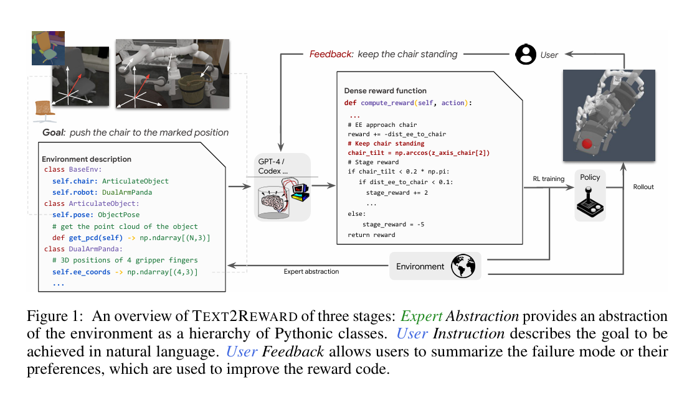 | [Code](https://github.com/xlang-ai/text2reward) | <details><summary>bib.tex</summary><pre><code class="language-bibtex">@inproceedings{xietext2reward,<br>  title={Text2Reward: Reward Shaping with Language Models for Reinforcement Learning},<br>  author={Xie, Tianbao and Zhao, Siheng and Wu, Chen Henry and Liu, Yitao and Luo, Qian and Zhong, Victor and Yang, Yanchao and Yu, Tao},<br>  booktitle={The Twelfth International Conference on Learning Representations},<br>  year={2024},<br>  url={https://openreview.net/forum?id=tUM39YTRxH}<br>}</code></pre></details> |
| 2023/06<br>CoRL'23 | [**Language to Rewards for Robotic Skill Synthesis**](https://proceedings.mlr.press/v229/yu23a.html) | 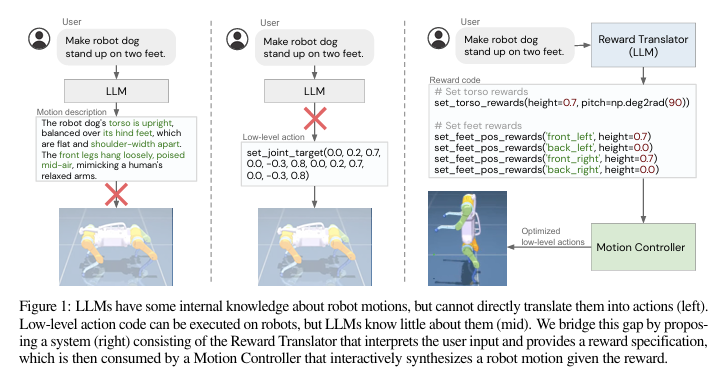 | [Code](https://github.com/google-deepmind/language_to_reward_2023) | <details><summary>bib.tex</summary><pre><code class="language-bibtex">@inproceedings{pmlr-v229-yu23a,<br>  title={Language to Rewards for Robotic Skill Synthesis},<br>  author={Yu, Wenhao and Gileadi, Nimrod and Fu, Chuyuan and Kirmani, Sean and Lee, Kuang-Huei and Gonzalez Arenas, Montserrat and Chiang, Hao-Tien Lewis and Erez, Tom and Hasenclever, Leonard and Humplik, Jan and Ichter, Brian and Xiao, Ted and Xu, Peng and Zeng, Andy and Zhang, Tingnan and Heess, Nicolas and Sadigh, Dorsa and Tan, Jie and Tassa, Yuval and Xia, Fei},<br>  booktitle={Proceedings of The 7th Conference on Robot Learning},<br>  pages={374--404},<br>  year={2023},<br>  editor={Tan, Jie and Toussaint, Marc and Darvish, Kourosh},<br>  volume={229},<br>  series={Proceedings of Machine Learning Research},<br>  publisher={PMLR},<br>  url={https://proceedings.mlr.press/v229/yu23a.html}<br>}</code></pre></details> |

## Data & Benchmark Lens

<p align="center">
  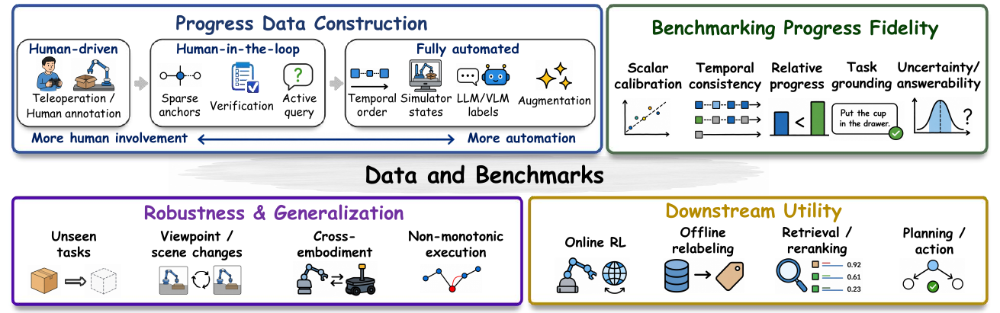
</p>

### How progress supervision is constructed

| Human involvement | Typical pipeline | Trade-off |
|---|---|---|
| **Human-driven** | teleoperation, human videos, scalar labels, success cutoffs, keyframes, reward sketches, comparisons | strongest semantic grounding; expensive and subjective |
| **Human-in-the-loop** | sparse anchors, interpolation, model proposals with verification, active queries, prompt/API design | balances control and scale; sparse checks can miss systematic errors |
| **Fully automated** | temporal order, simulator predicates, expert/noisy policies, VLM/LLM labels, synthetic reversals and failures | scales well; inherits simplifying assumptions and annotator bias |

### What a benchmark can actually validate

| Evaluation goal | What it tests | Representative evidence |
|---|---|---|
| **Progress fidelity** | Does the score represent advancement? | scalar calibration · temporal consistency · relative ordering · task grounding · uncertainty/answerability |
| **Robustness & generalization** | Does that meaning survive distribution shift? | unseen tasks · new viewpoints/scenes · cross-embodiment transfer · non-monotonic execution |
| **Downstream utility** | Is the signal useful for decision making? | online RL · offline relabeling · retrieval/reranking · planning/action selection |

> A reward can improve policy learning without faithfully representing progress. Conversely, a calibrated progress estimator may still be too sparse, noisy, or expensive for closed-loop control. The survey treats fidelity and utility as separate claims.

## Open Problems

- **Weak temporal assumptions.** Later frames are not necessarily better under pauses, retries, regressions, or alternative strategies.
- **Partial observability.** RGB alone may miss history, contact force, grasp stability, slipping, and other physical state.
- **Generalization and calibration.** Scores often change meaning across tasks, views, scenes, and embodiments; uncertainty and abstention remain underdeveloped.
- **Closed-loop reliability.** Automatic labels can be biased, learned rewards can be exploited, and frequent reward queries can be costly.

## Repository Layout

```text
.
├── README.md            # survey map + curated paper gallery
├── img/                 # paper previews and README-ready figures
└── CONTRIBUTING.md
```

## Citation

Until archival release metadata is available, use this repository citation:

```bibtex
@misc{zhang2026progressrewardmodeling,
  title  = {Progress Reward Modeling for Robotic Learning: A Comprehensive Survey},
  author = {Zhang, Jianshu and Wu, Keliang and Lu, Haoran and Liu, Anbang and
            Zhang, Ce and Yin, Weijie and Qian, Chengxuan and Yang, Xiyuan and
            Pan, Zhenyu and Ye, Guo and Liu, Han},
  year   = {2026},
  note   = {Survey manuscript},
  url    = {https://github.com/sterzhang/Awesome-Progress-Models}
}
```

## Contributing

Contributions are welcome through pull requests. Please follow [CONTRIBUTING.md](CONTRIBUTING.md).

To keep this repository consistent with the survey, new README entries should either be cited in the survey or be proposed together with the corresponding survey citation update.
